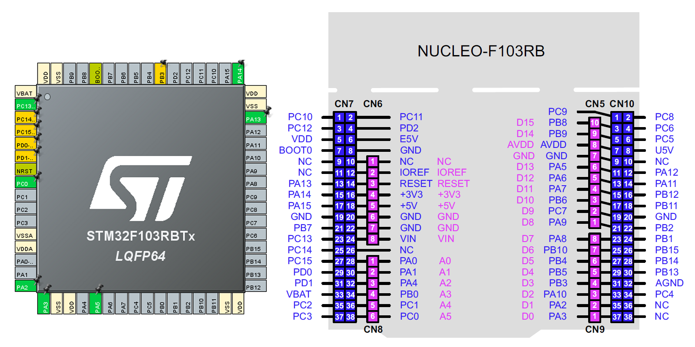

## STM32

STM32CubeIDE 환경에서 NUCLEO-F103RB 보드를 타겟으로 MCU가 제공하는 기본 기능 구현 튜토리얼

[1. LED_Blink( GPIO 출력)](./doc/Blink/Blink.md) 

[2. UART2LED( UART 수신 데이터에의한 LED제어)](./doc/UART2LED/UART2LED.md) 

[3. printf(USART2를 이용한 printf( )구현)](./doc/printf/printf.md) 

[4. printf_lib(printf() 사용자 라이브러리](./doc/printf_lib/printf_lib.md) 

[5. ADC_VR](./doc/ADC_VR/ADC_VR.md) 

[5. Buzzer](./doc/Buzzer/Buzzer.md) 

---

### STM32F103RB & NUCLEO-F103RB PINMAP

