## STM32Cube를 이용한 STM32 프로그래밍

### 온보드 LED를 0.5초동안 점등, 0.5초 동안 소등을 반복하는 LED Blink 구현

문서 작성 환경

**OS** MS Windows11

**타겟보드** NUCLEO-F103RB

**SW Tool** STM32CubeMX 6.18.1 / STM32CubeIDE 2.20

---

**CubeMX에서 설정할 Peripheral**

​	**- RCC : ** 클럭 소스 설정

​	**- GPIO(PA5) : ** 출력으로 설정(온 보드 LED제어)


새로운 STM32 프로젝트 생성을 위해 STM32CubeMX 실행 후, 타겟 설정을 위해 **ACCESS TO BOARD SELECTOR**를 클릭한다.


New Project from Board 화면의 **PRODUCT INFO**의 **Type**에서 **Nucleo-64**를 체크한다. 


New Project fron Board 화면의 **PRODUCT INFO**를 스크롤다운해서 **MCU/MPU Series**에서 **STM32F1**을 체크하면 화면 우측의 **Board List**가 확 줄어든 것을 볼 수 있다. 그 중에서 타겟보드로 사용중인 **NUCLEO-F103RB**를 선택 후 화면 오른쪽 상단의 **Start Project**를 클릭한다.


모든 주변장치들을 기본 모드로 초기화 하겠냐는 팝업창이 나타나면 [  <u>Y</u>es  ]를 클릭한다.


최우선으로 설정해야 하는 것은 **RCC** 설정이다. **Pinout & Configuration**탭에서 **System Core**를 선택 후,  **RCC**를 클릭하고 바로 우측의 RCC Mode and Configuration의 Mode에서 High Speed Clock(HSE)와 Low Speed Clock(LSE)를 모두 Disable로 설정한다. 이는 모든 외부 클럭을 Disable시킨 것으로 내부클럭을 사용하겠다는 의미이다.

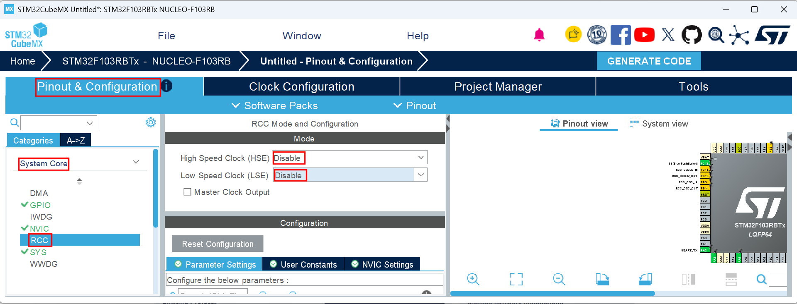

CLOCK설정 확인을 위해 **Clock Configuration**탭을 클릭하여 최초 HSI(High Speed Internal Clock) 8MHz 소스 클럭이 64MHz의 시스템 클럭으로 공급됨을 확인한다.

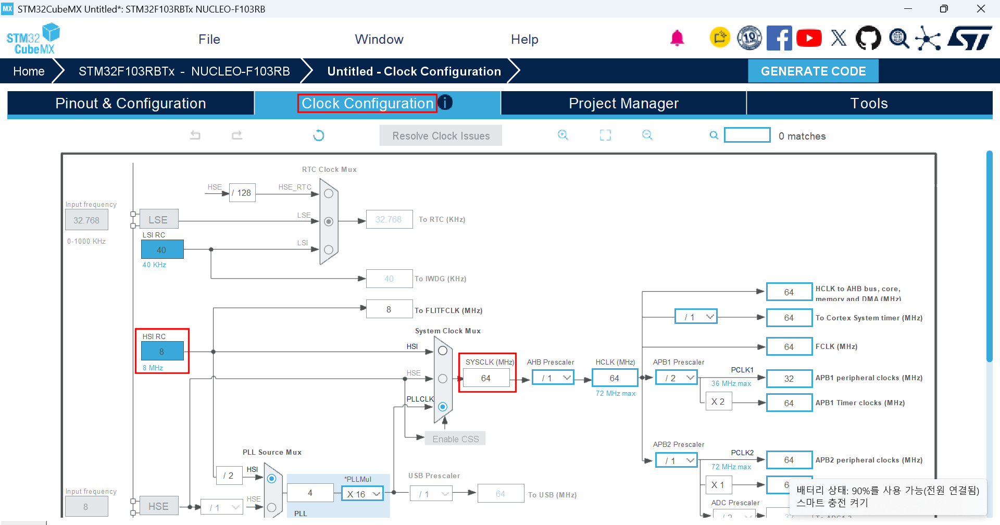


GPIO 설정을 위해 다시 **Pinout & Configuration**탭으로 돌아가서 **Pin out view**에서 **PA5**를 GPIO_Output으로 설정한다.

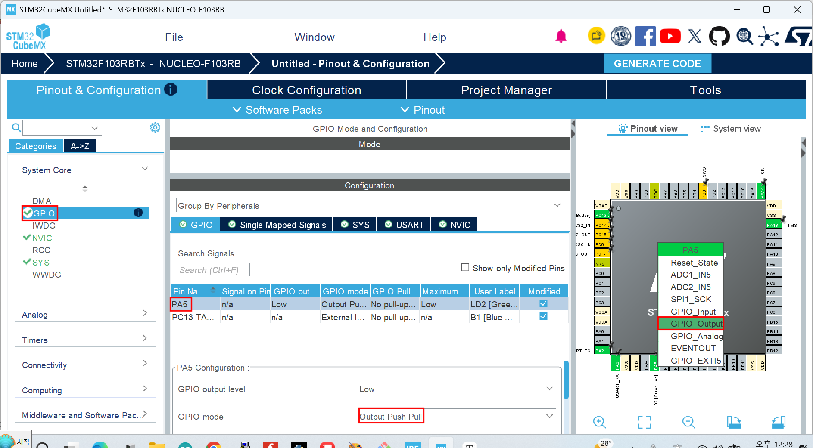


지금까지의 설정을 반영한 코드를 생성하기위해 **Generate Code**를 클릭 하기 전 **STM32CubeMX**에서 생성한 프로젝트들을 저장해 둘 폴더를 만들어 두어야 한다. 그 위치는 편의상 **STM32CubeIDEworkspace_2.2.0** 폴더와 같은 폴더에, 폴더 이름은 **STM32CubeProjects**(폴더 이름은 다른 임의의이름을 사용해도 되나 그 위치와 이름을 정확히 기억하자 )로 만들어 둔다. 아래 그림에서도 **STM32CubeIDEworkspace_2.2.0**폴더가 있는 위치에 **STM32CubeProjects** 폴더가 만들어져 있는 것을 확인할 수 있다.


이제 **Project Manager** 탭을 클릭한다. 


**Project Name** : Blink

**Project Location** : 앞서 **STM32CubeMX**에서 생성한 프로젝트들을 저장하기위해 **STM32CubeIDEworkspace_2.2.0** 폴더와 같은 위치에 만들어 둔 **STM32CubeProjects** 폴더를 지정한다.

**Toolchain / IDE** : STM32CubeIDE를 선택한다.( **<u>매우 중요함.</u>** )

**GENERATE CODE**를 클릭한다.


The Code is successfully generated... 팝업 메세지 창에서 [ Close ] 를 클릭한다.

 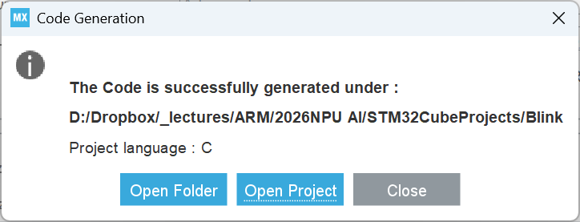

이제 STM32CubeIDE를 실행하여 STM32CubeMX에서 생성한 코드를 import 한다. 

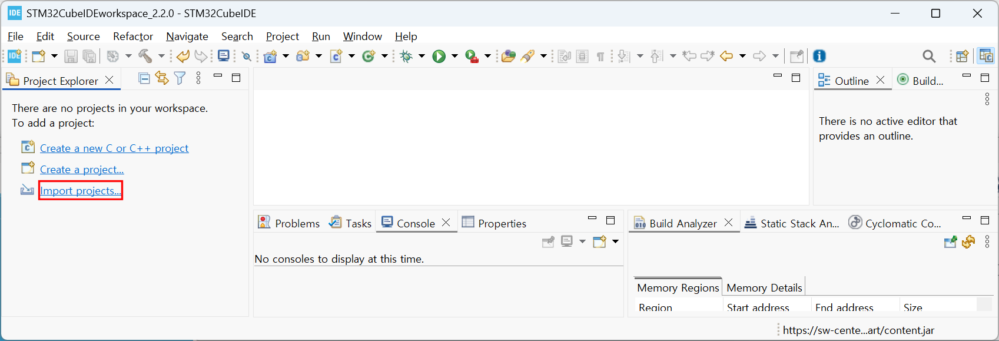


**STM32CubeMX/STM32CubeIDE Project** 선택 후 [ <u>N</u>ext > ]를 클릭한다.

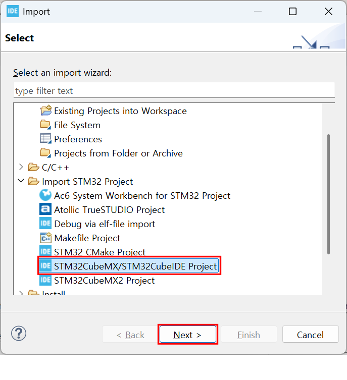


STM32CubeMX에서 저장한 프로젝트 폴더를 선택하면 아래 그림과같이 해당 프로젝트 폴더가 자동으로 선택되어야 한다. 그렇지 않은 경우는 대부분 **STM32CubeMX**의 **GENERATE CODE**과정에서 **Toolchain / IDE**를 **STM32CubeIDE**로 변경하지 않은 경우이다. 해당 프로젝트 폴더의 선택이 확인되었다면 이제 [ <u>F</u>inish ]를 클릭한다.

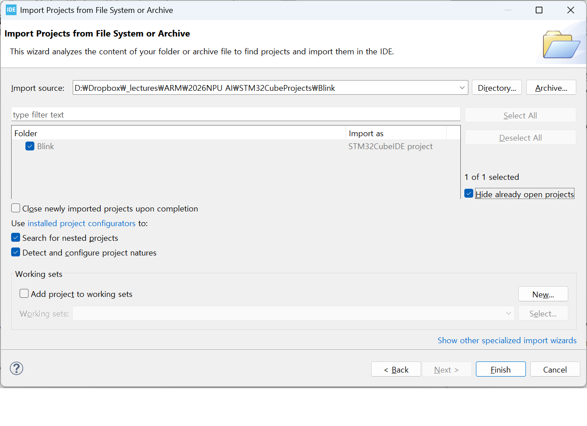

**STM32CubeIDE**의 **Project Explorer**창에 좀 전에 **import**한 Blink프로젝트가 나타난 것을 확인할 수 있다.

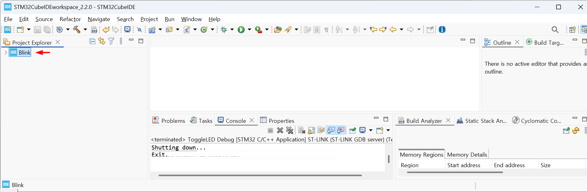

**STM32CubeIDE**의 Project Explorer창의 Blink프로젝트를 확장시켜 Core-Src-main.c를 찾아 연다.

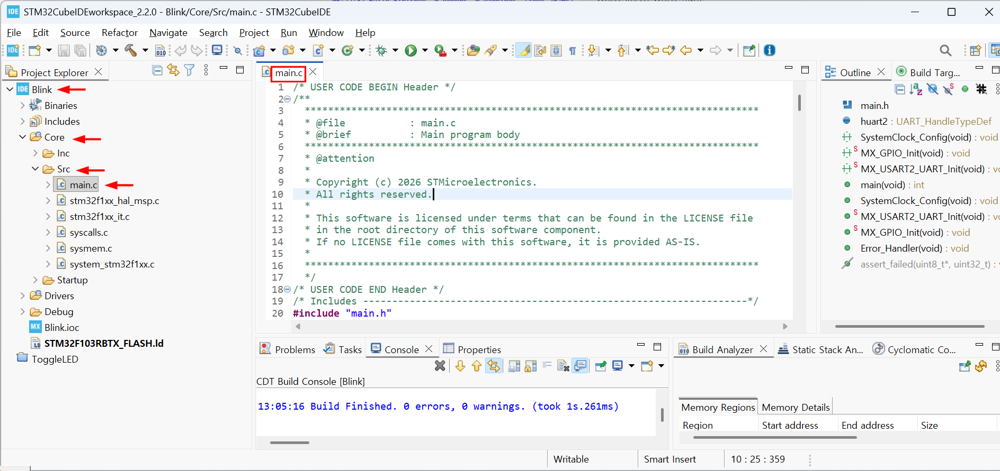

다음은 **STM32CubeMX**에서 **ToggleLED**프로젝트에 대해 자동 생성한 **main.c**의 내용이다.

```c
/* USER CODE BEGIN Header */
/**
  ******************************************************************************
  * @file           : main.c
  * @brief          : Main program body
  ******************************************************************************
  * @attention
  *
  * Copyright (c) 2026 STMicroelectronics.
  * All rights reserved.
  *
  * This software is licensed under terms that can be found in the LICENSE file
  * in the root directory of this software component.
  * If no LICENSE file comes with this software, it is provided AS-IS.
  *
  ******************************************************************************
  */
/* USER CODE END Header */
/* Includes ------------------------------------------------------------------*/
#include "main.h"

/* Private includes ----------------------------------------------------------*/
/* USER CODE BEGIN Includes */

/* USER CODE END Includes */

/* Private typedef -----------------------------------------------------------*/
/* USER CODE BEGIN PTD */

/* USER CODE END PTD */

/* Private define ------------------------------------------------------------*/
/* USER CODE BEGIN PD */

/* USER CODE END PD */

/* Private macro -------------------------------------------------------------*/
/* USER CODE BEGIN PM */

/* USER CODE END PM */

/* Private variables ---------------------------------------------------------*/
UART_HandleTypeDef huart2;

/* USER CODE BEGIN PV */

/* USER CODE END PV */

/* Private function prototypes -----------------------------------------------*/
void SystemClock_Config(void);
static void MX_GPIO_Init(void);
static void MX_USART2_UART_Init(void);
/* USER CODE BEGIN PFP */

/* USER CODE END PFP */

/* Private user code ---------------------------------------------------------*/
/* USER CODE BEGIN 0 */

/* USER CODE END 0 */

/**
  * @brief  The application entry point.
  * @retval int
  */
int main(void)
{

  /* USER CODE BEGIN 1 */

  /* USER CODE END 1 */

  /* MCU Configuration--------------------------------------------------------*/

  /* Reset of all peripherals, Initializes the Flash interface and the Systick. */
  HAL_Init();

  /* USER CODE BEGIN Init */

  /* USER CODE END Init */

  /* Configure the system clock */
  SystemClock_Config();

  /* USER CODE BEGIN SysInit */

  /* USER CODE END SysInit */

  /* Initialize all configured peripherals */
  MX_GPIO_Init();
  MX_USART2_UART_Init();
  /* USER CODE BEGIN 2 */

  /* USER CODE END 2 */

  /* Infinite loop */
  /* USER CODE BEGIN WHILE */
  while (1)
  {
    /* USER CODE END WHILE */

    /* USER CODE BEGIN 3 */
  }
  /* USER CODE END 3 */
}

/**
  * @brief System Clock Configuration
  * @retval None
  */
void SystemClock_Config(void)
{
  RCC_OscInitTypeDef RCC_OscInitStruct = {0};
  RCC_ClkInitTypeDef RCC_ClkInitStruct = {0};

  /** Initializes the RCC Oscillators according to the specified parameters
  * in the RCC_OscInitTypeDef structure.
  */
  RCC_OscInitStruct.OscillatorType = RCC_OSCILLATORTYPE_HSI;
  RCC_OscInitStruct.HSIState = RCC_HSI_ON;
  RCC_OscInitStruct.HSICalibrationValue = RCC_HSICALIBRATION_DEFAULT;
  RCC_OscInitStruct.PLL.PLLState = RCC_PLL_ON;
  RCC_OscInitStruct.PLL.PLLSource = RCC_PLLSOURCE_HSI_DIV2;
  RCC_OscInitStruct.PLL.PLLMUL = RCC_PLL_MUL16;
  if (HAL_RCC_OscConfig(&RCC_OscInitStruct) != HAL_OK)
  {
    Error_Handler();
  }

  /** Initializes the CPU, AHB and APB buses clocks
  */
  RCC_ClkInitStruct.ClockType = RCC_CLOCKTYPE_HCLK|RCC_CLOCKTYPE_SYSCLK
                              |RCC_CLOCKTYPE_PCLK1|RCC_CLOCKTYPE_PCLK2;
  RCC_ClkInitStruct.SYSCLKSource = RCC_SYSCLKSOURCE_PLLCLK;
  RCC_ClkInitStruct.AHBCLKDivider = RCC_SYSCLK_DIV1;
  RCC_ClkInitStruct.APB1CLKDivider = RCC_HCLK_DIV2;
  RCC_ClkInitStruct.APB2CLKDivider = RCC_HCLK_DIV1;

  if (HAL_RCC_ClockConfig(&RCC_ClkInitStruct, FLASH_LATENCY_2) != HAL_OK)
  {
    Error_Handler();
  }
}

/**
  * @brief USART2 Initialization Function
  * @param None
  * @retval None
  */
static void MX_USART2_UART_Init(void)
{

  /* USER CODE BEGIN USART2_Init 0 */

  /* USER CODE END USART2_Init 0 */

  /* USER CODE BEGIN USART2_Init 1 */

  /* USER CODE END USART2_Init 1 */
  huart2.Instance = USART2;
  huart2.Init.BaudRate = 115200;
  huart2.Init.WordLength = UART_WORDLENGTH_8B;
  huart2.Init.StopBits = UART_STOPBITS_1;
  huart2.Init.Parity = UART_PARITY_NONE;
  huart2.Init.Mode = UART_MODE_TX_RX;
  huart2.Init.HwFlowCtl = UART_HWCONTROL_NONE;
  huart2.Init.OverSampling = UART_OVERSAMPLING_16;
  if (HAL_UART_Init(&huart2) != HAL_OK)
  {
    Error_Handler();
  }
  /* USER CODE BEGIN USART2_Init 2 */

  /* USER CODE END USART2_Init 2 */

}

/**
  * @brief GPIO Initialization Function
  * @param None
  * @retval None
  */
static void MX_GPIO_Init(void)
{
  GPIO_InitTypeDef GPIO_InitStruct = {0};
  /* USER CODE BEGIN MX_GPIO_Init_1 */

  /* USER CODE END MX_GPIO_Init_1 */

  /* GPIO Ports Clock Enable */
  __HAL_RCC_GPIOC_CLK_ENABLE();
  __HAL_RCC_GPIOD_CLK_ENABLE();
  __HAL_RCC_GPIOA_CLK_ENABLE();
  __HAL_RCC_GPIOB_CLK_ENABLE();

  /*Configure GPIO pin Output Level */
  HAL_GPIO_WritePin(LD2_GPIO_Port, LD2_Pin, GPIO_PIN_RESET);

  /*Configure GPIO pin : B1_Pin */
  GPIO_InitStruct.Pin = B1_Pin;
  GPIO_InitStruct.Mode = GPIO_MODE_IT_RISING;
  GPIO_InitStruct.Pull = GPIO_NOPULL;
  HAL_GPIO_Init(B1_GPIO_Port, &GPIO_InitStruct);

  /*Configure GPIO pin : LD2_Pin */
  GPIO_InitStruct.Pin = LD2_Pin;
  GPIO_InitStruct.Mode = GPIO_MODE_OUTPUT_PP;
  GPIO_InitStruct.Pull = GPIO_NOPULL;
  GPIO_InitStruct.Speed = GPIO_SPEED_FREQ_LOW;
  HAL_GPIO_Init(LD2_GPIO_Port, &GPIO_InitStruct);

  /* EXTI interrupt init*/
  HAL_NVIC_SetPriority(EXTI15_10_IRQn, 0, 0);
  HAL_NVIC_EnableIRQ(EXTI15_10_IRQn);

  /* USER CODE BEGIN MX_GPIO_Init_2 */

  /* USER CODE END MX_GPIO_Init_2 */
}

/* USER CODE BEGIN 4 */

/* USER CODE END 4 */

/**
  * @brief  This function is executed in case of error occurrence.
  * @retval None
  */
void Error_Handler(void)
{
  /* USER CODE BEGIN Error_Handler_Debug */
  /* User can add his own implementation to report the HAL error return state */
  __disable_irq();
  while (1)
  {
  }
  /* USER CODE END Error_Handler_Debug */
}
#ifdef USE_FULL_ASSERT
/**
  * @brief  Reports the name of the source file and the source line number
  *         where the assert_param error has occurred.
  * @param  file: pointer to the source file name
  * @param  line: assert_param error line source number
  * @retval None
  */
void assert_failed(uint8_t *file, uint32_t line)
{
  /* USER CODE BEGIN 6 */
  /* User can add his own implementation to report the file name and line number,
     ex: printf("Wrong parameters value: file %s on line %d\r\n", file, line) */
  /* USER CODE END 6 */
}
#endif /* USE_FULL_ASSERT */

```

지금 구현하려는 것은 **NUCLEO-F103RB**타겟보드의 녹색 LED가 0.5초간 점등, 0.5초간 소등을 반복, 점멸하는 동작이다. 이를 구현하기 위해 필요한 HAL(Hardware Abstract Layer:하드웨어 추상화 계층) 라이브러리는 **GPIO**로 신호를 출력하는 HAL_GPIO_WritePin( )과 밀리초(msec)단위의 시간지연 함수 HAL_Delay( ) 2가지이다.

`main.c`의 98~101행의 다음 코드를 찾는다.

```c
/* USER CODE BEGIN WHILE */
  while (1)
  {
    /* USER CODE END WHILE */
```

위코드를 다음과 같이 수정 편집 후 저장한다.

```c
/* USER CODE BEGIN WHILE */
  while (1)
  {
	  HAL_GPIO_WritePin(GPIOA, GPIO_PIN_5, 1);
	  HAL_Delay(500);
	  HAL_GPIO_WritePin(GPIOA, GPIO_PIN_5, 0);
	  HAL_Delay(500);
    /* USER CODE END WHILE */
```


**STM32CubeIDE**의 **<u>P</u>roject**메뉴의 **Build_Project**항목을 클릭하여 빌드한다.

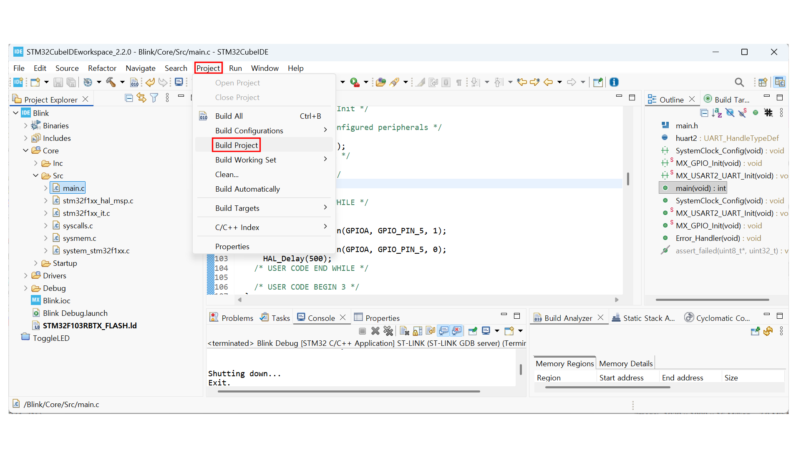


빌드 결과는 **ST-Link**를 통해 타겟보드에 업로드 해야 하므로 그 전에  **ST-Link**의 펌웨어를 업그레이드 하기 위해 **<u>H</u>elp**메뉴의 **ST-Link Upgrade**항목을 클릭한다.


[ Open in update mode ] 버튼을 클릭한다.


[ Open in update mode ] 를 클릭 하면 Unknown으로  표시되던 Current Firmware Type 및 Version, Update to Firmware 정보가 표시된다. 이 때 [Upgrade] 버튼을 클릭한다.


업그레이드 진행상태가 표시된다.


업그레이드가 완료되면 Upgrade sucessful. 메세지가 나타난다.


새로운 **ST-Link** 펌웨어가 나오지 않는 한 더 이상의 업데이트는  필요 없다. 이제 앞서 빌드한 결과를 타겟보드에 올려 동작 시켜보자. **STM32CubeIDE**의 **<u>R</u>UN**메뉴의 **Run**항목을 클릭한다.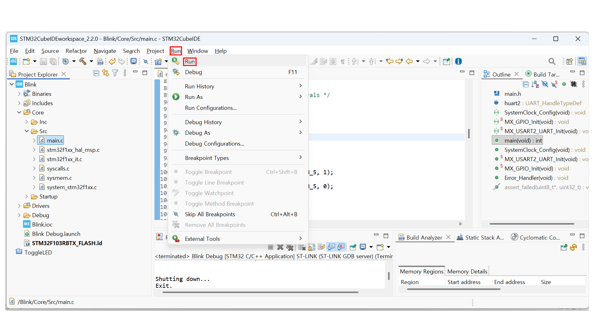

타겟보드의 USB 컨넥터 옆 LED의 깜박거림이 멈추면 프로그램 업로드가 완료된 것이다, 이제 검정색 리셋 스위치 아래의 녹색 LED가 0.5초간 점등, 0.5초간 소등을 반복하며 점멸하는 지 확인한다.


[목차](../README.md) 
