## STM32Cube를 이용한 STM32 프로그래밍

### HC-SR04 초음파 센서를 이용한 거리측정

**STM32CubeMX**와 **STM32CubeIDE**를 이용하여  **NUCLEO-F103RB**보드에 연결한 HC-SR04초음파 센서를 이용한 거리 측정.

#### 개발 환경

**OS:** MS Windows11

**타겟보드:** NUCLEO-F103RB

**SW Tools:** [STM32CubeMX 6.18.1](https://www.st.com/en/development-tools/stm32cubemx.html) / [STM32CubeIDE 2.20](https://www.st.com/en/development-tools/stm32cubeide.html)

---


HC-SR04초음파 센서와 NUCLEO-F103RB 타겟보드와의 결선은 다음과 같이 연결한다.

| HC-SR04 | NUCLEO-F103RB |
| ------- | ------------- |
| Trig    | PB4           |
| Echo    | PB5           |
| GND     | GND           |
| VCC     | +5V           |

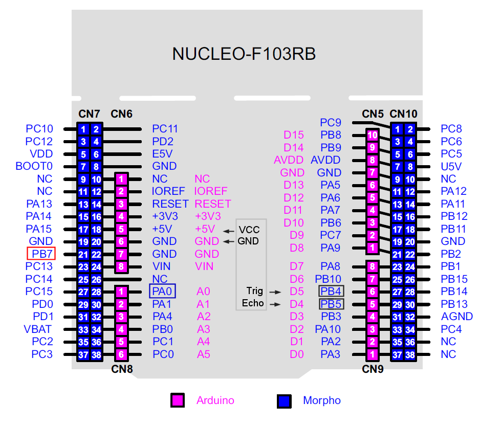

---

**CubeMX에서 설정할 Peripheral**

​	**1. RCC** HSI(High Speed Internal Clock) 64MHz로 설정

**2. GPIO** PB4(HC-SR04의 Trig 연결) 를 GPIO Output으로, PB5(HC-SR04의 echo 연결) GPIO Input으로 설정

**3. TIM2** HC-SR04 센서에서 발사된 초음파가 측정 대상까지 왕복하는 데 걸린 시간의 ㎲단위 측정을 위한 타이머 설정

새로운 STM32 프로젝트 생성을 위해 STM32CubeMX 실행 후, 타겟 설정을 위해 **ACCESS TO BOARD SELECTOR**를 클릭한다.


New Project from Board 화면의 **PRODUCT INFO**의 **Type**에서 **Nucleo-64**를 체크한다. 

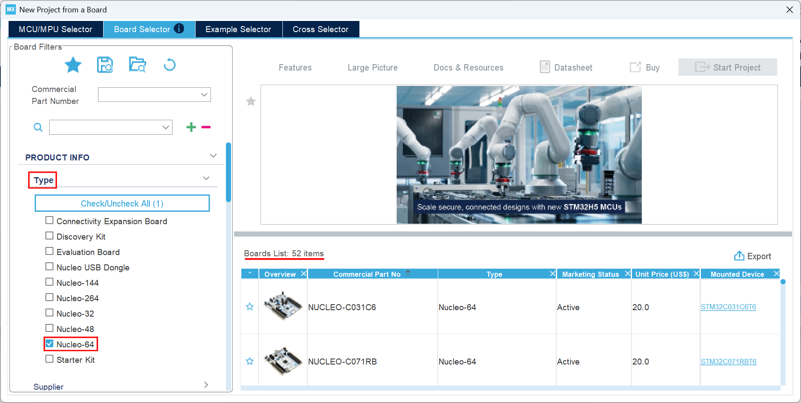

New Project fron Board 화면의 **PRODUCT INFO**를 스크롤다운해서 **MCU/MPU Series**에서 **STM32F1**을 체크하면 화면 우측의 **Board List**가 확 줄어든 것을 볼 수 있다. 그 중에서 타겟보드로 사용중인 **NUCLEO-F103RB**를 선택 후 화면 오른쪽 상단의 **Start Project**를 클릭한다.


위 모든 주변장치들을 기본 모드로 초기화 하겠냐는 팝업창에서 	[ Yes ]를 클릭하면

**GPIO** **PA5**는 Output Push pull로,  **PC13**은 External Interrupt Mode with Rising edge trigger detection으로 설정되고

**USART2**는 **Baudrate**115200,  **Parity** none, **Data** 8bit, **Stop** 1bit가 **default**(기본값)로 설정된다.


최우선으로 설정해야 하는 것은 **RCC** 설정이다. **Pinout & Configuration**탭에서 **System Core**를 선택 후,  **RCC**를 클릭하고 바로 우측의 RCC Mode and Configuration의 Mode에서 High Speed Clock(HSE)와 Low Speed Clock(LSE)를 모두 Disable로 설정한다. 이는 모든 외부 클럭을 Disable시킨 것으로 **HSI**(High Speed Internal Clock)를 클럭 소스로 사용하겠다는 의미이다.


CLOCK설정 확인을 위해 **Clock Configuration**탭을 클릭하여 최초 **HSI**(High Speed Internal Clock) 8MHz를 소스 클럭으로 시작하여 64MHz의 시스템 클럭으로 공급되는 것을 확인한다.


아래 그림에 따르면 TIM2는 APB1버스에 연결되어 있고, 위 그림에 따르면 APB1 Timer clock이 64MHz이므로, TIM2에 공급되는 클럭은 64MHz이다.

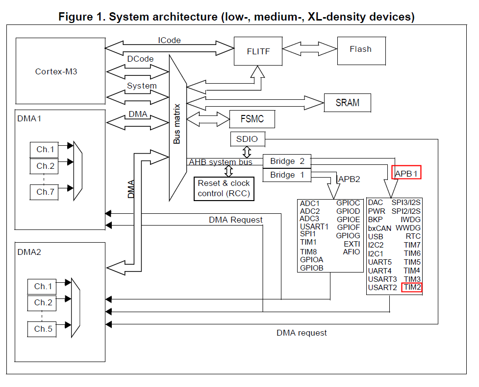

TIM2를 1㎲마다 카운트 값이 1씩 증가하도록 설정하려면 1/1,000,000초 주기의 클럭 펄스가 타이머에 공급되도록 설정해야한다. 이는 1,000,000(Hz) = 1(MHz)클럭 펄스가 타이머에 공급되도록 설정해야 하는데 앞서 살펴본 바에 따르면 TIM2에 공급되는 클럭 펄스가 64(MHz)이므로 Prescaler 값을 64-1로 설정하여 TIM2를 **1 μs 단위 free-running counter**로 동작시킬 수 잇다. 따라서 Counter Period값은 16비트 카운터가 카운트 할 수 있는 최대값인 65535로 설정한다.

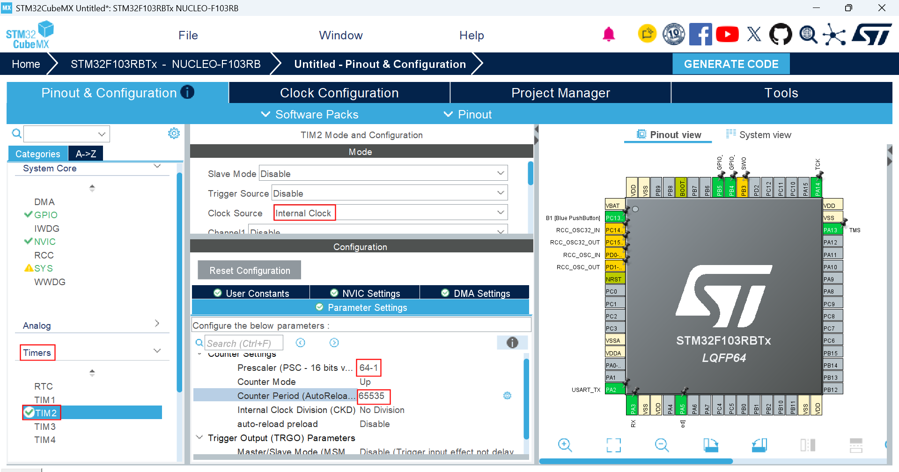

HC-SR04 초음파센서의 Trig핀이 연결된 PB4는 GPIO Output으로 설정한다.

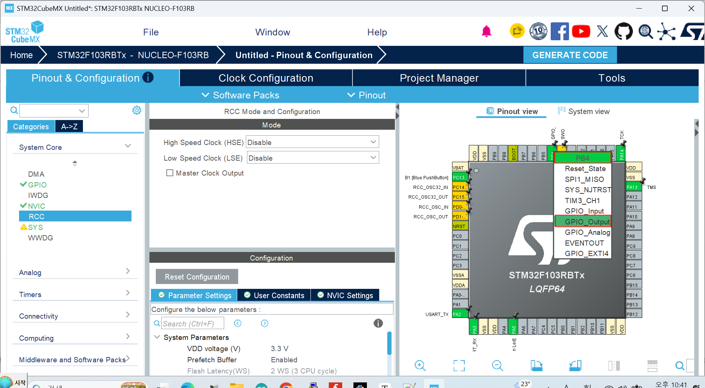


HC-SR04 초음파센서의 Echo핀이 연결된 PB5는 GPIO Input으로 설정한다.

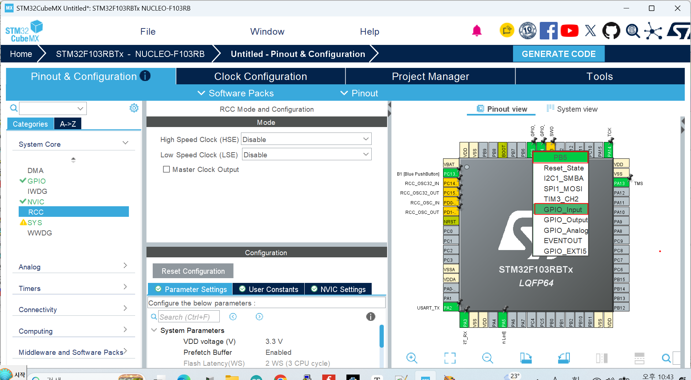


여기까지 설정을 반영한 코드 생성을위해 **Generate Code**를 클릭 하기 전 **STM32CubeMX**에서 생성한 프로젝트들을 저장해 둘 폴더를 만들어 두어야 한다. 그 위치는 편의상 **STM32CubeIDEworkspace_2.2.0** 폴더와 같은 폴더에, 폴더 이름은 **STM32CubeProjects**(폴더 이름은 다른 임의의이름(영문, 숫자 조합 한글×)을 사용해도 되나 그 위치와 이름을 정확히 기억하자 )로 만들어 둔다. 아래 그림에서도 **STM32CubeIDEworkspace_2.2.0**폴더가 있는 위치에 **STM32CubeProjects** 폴더가 만들어져 있는 것을 확인할 수 있다.


이제 **Project Manager** 탭을 클릭한다. 

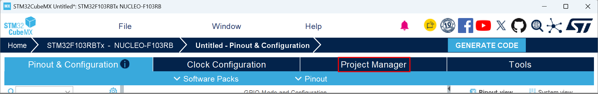


아래와 같이 Project Manager 화면이 열린다.

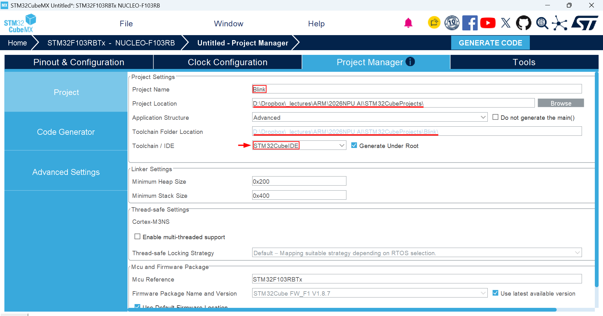

**1. Project Location** : [Browse]버튼을 클릭하여 앞서 **STM32CubeMX**에서 생성한 프로젝트들을 저장하기위해 만들어 둔 **STM32CubeProjects** 폴더를 지정한다. 이 작업이 선행되어야 다음 단계에서 입력한 **Project Name**과 같은 이름의 폴더가 이 위치에 생성될 수 있다.

**2. Project Name** :프로젝트 이름을 영문, 숫자 조합으로 작성(한글×)한다.

**3. Toolchain / IDE** : STM32CubeIDE를 선택한다.( **매우 중요함.** 잘못 지정되어 있을 경우 **STM32CubeIDE**에서 프로젝트가 열리지 않는다. )

**4. GENERATE CODE**를 클릭한다.


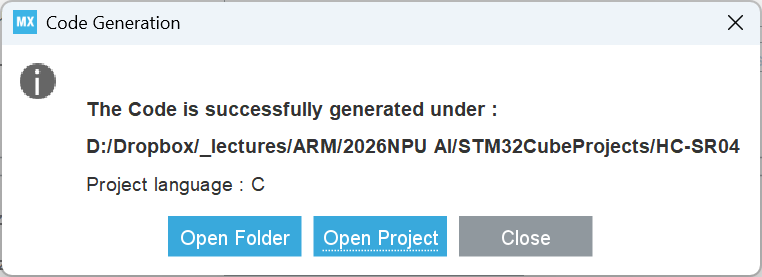

위 The Code is successfully generated... 팝업 메세지 창에서 **[ Open Project ]** 를 클릭하면 Project Manager에서 Toolchain / IDE로 지정한 **STM32CubeIDE**가 자동 실행되며 해당 프로젝트가 **STM32CubeIDE**의 워크스페이스에 성공적으로 Import되었다는 팝업과 함께 Project Explore에 해당 프로젝트가 열린다.

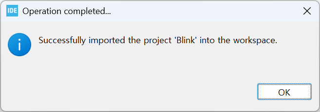

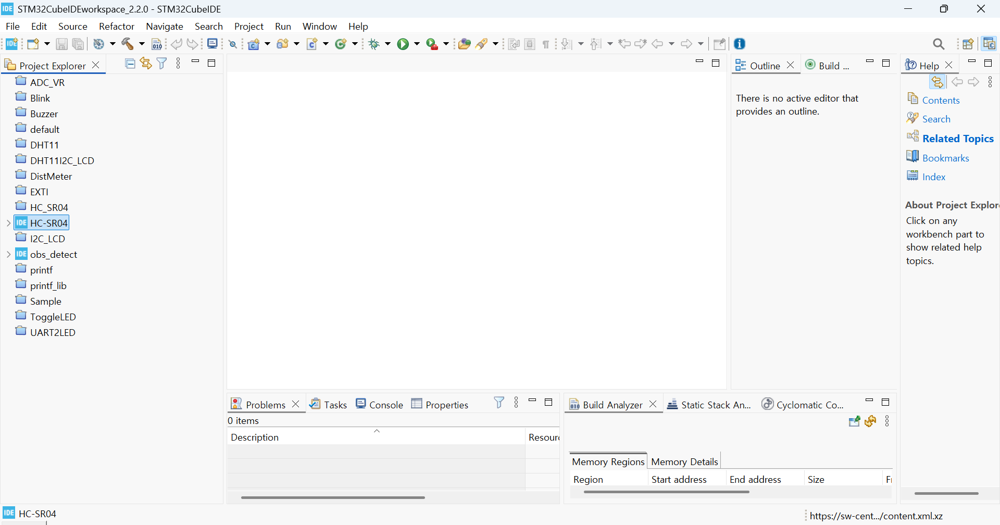

사용자 정의 라이브러리들 중 `uart2_printf.h`와 `delay_us.h`를 HC-SR04프로젝트 폴더의 Core-Inc 폴더에, `uart2_printf.c`와 `delay_us.c`를 HC-SR04프로젝트 폴더의 Core-Src 폴더에 복사 후 Project Explorer에서 HC-SR04프로젝트 선택 후 [F5]키를 눌러 Refresh시킨다.

**Project Explorer**에서 **Blink** > **Core** > **Src** > **main.c** 순서로 각 항목을 확장시켜 **main.c**를 연다.

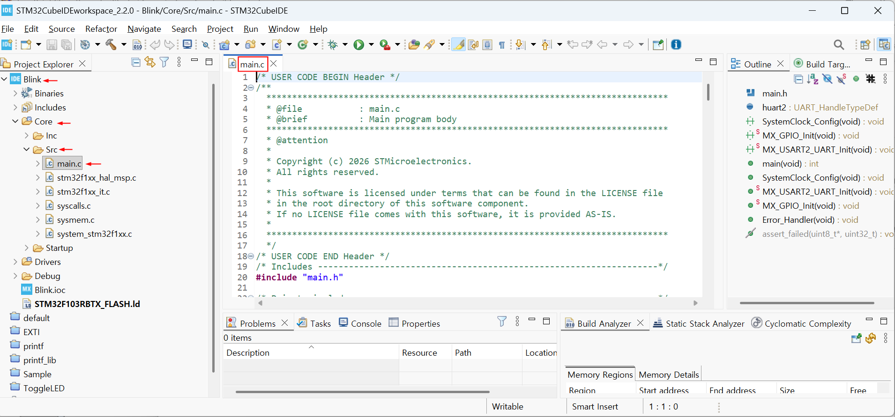


**STM32CubeIDE** 의 **Project**메뉴의 **Build Project**항목을 클릭하여 테스트 빌드를 수행한다.

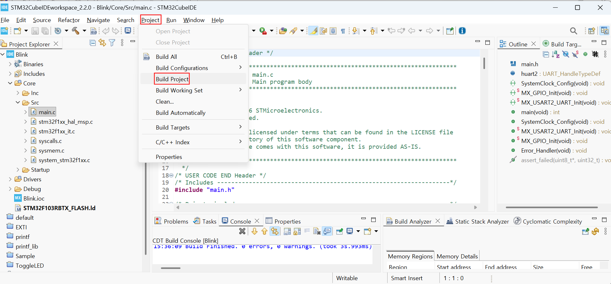


다음은 **STM32CubeMX**에서 **ToggleLED**프로젝트에 대해 자동 생성한 **main.c**의 내용이다.

```c
/* USER CODE BEGIN Header */
/**
  ******************************************************************************
  * @file           : main.c
  * @brief          : Main program body
  ******************************************************************************
  * @attention
  *
  * Copyright (c) 2026 STMicroelectronics.
  * All rights reserved.
  *
  * This software is licensed under terms that can be found in the LICENSE file
  * in the root directory of this software component.
  * If no LICENSE file comes with this software, it is provided AS-IS.
  *
  ******************************************************************************
  */
/* USER CODE END Header */
/* Includes ------------------------------------------------------------------*/
#include "main.h"

/* Private includes ----------------------------------------------------------*/
/* USER CODE BEGIN Includes */

/* USER CODE END Includes */

/* Private typedef -----------------------------------------------------------*/
/* USER CODE BEGIN PTD */

/* USER CODE END PTD */

/* Private define ------------------------------------------------------------*/
/* USER CODE BEGIN PD */

/* USER CODE END PD */

/* Private macro -------------------------------------------------------------*/
/* USER CODE BEGIN PM */

/* USER CODE END PM */

/* Private variables ---------------------------------------------------------*/
TIM_HandleTypeDef htim2;

UART_HandleTypeDef huart2;

/* USER CODE BEGIN PV */

/* USER CODE END PV */

/* Private function prototypes -----------------------------------------------*/
void SystemClock_Config(void);
static void MX_GPIO_Init(void);
static void MX_TIM2_Init(void);
static void MX_USART2_UART_Init(void);
/* USER CODE BEGIN PFP */

/* USER CODE END PFP */

/* Private user code ---------------------------------------------------------*/
/* USER CODE BEGIN 0 */

/* USER CODE END 0 */

/**
  * @brief  The application entry point.
  * @retval int
  */
int main(void)
{

  /* USER CODE BEGIN 1 */

  /* USER CODE END 1 */

  /* MCU Configuration--------------------------------------------------------*/

  /* Reset of all peripherals, Initializes the Flash interface and the Systick. */
  HAL_Init();

  /* USER CODE BEGIN Init */

  /* USER CODE END Init */

  /* Configure the system clock */
  SystemClock_Config();

  /* USER CODE BEGIN SysInit */

  /* USER CODE END SysInit */

  /* Initialize all configured peripherals */
  MX_GPIO_Init();
  MX_TIM2_Init();
  MX_USART2_UART_Init();
  /* USER CODE BEGIN 2 */

  /* USER CODE END 2 */

  /* Infinite loop */
  /* USER CODE BEGIN WHILE */
  while (1)
  {
    /* USER CODE END WHILE */

    /* USER CODE BEGIN 3 */
  }
  /* USER CODE END 3 */
}

/**
  * @brief System Clock Configuration
  * @retval None
  */
void SystemClock_Config(void)
{
  RCC_OscInitTypeDef RCC_OscInitStruct = {0};
  RCC_ClkInitTypeDef RCC_ClkInitStruct = {0};

  /** Initializes the RCC Oscillators according to the specified parameters
  * in the RCC_OscInitTypeDef structure.
  */
  RCC_OscInitStruct.OscillatorType = RCC_OSCILLATORTYPE_HSI;
  RCC_OscInitStruct.HSIState = RCC_HSI_ON;
  RCC_OscInitStruct.HSICalibrationValue = RCC_HSICALIBRATION_DEFAULT;
  RCC_OscInitStruct.PLL.PLLState = RCC_PLL_ON;
  RCC_OscInitStruct.PLL.PLLSource = RCC_PLLSOURCE_HSI_DIV2;
  RCC_OscInitStruct.PLL.PLLMUL = RCC_PLL_MUL16;
  if (HAL_RCC_OscConfig(&RCC_OscInitStruct) != HAL_OK)
  {
    Error_Handler();
  }

  /** Initializes the CPU, AHB and APB buses clocks
  */
  RCC_ClkInitStruct.ClockType = RCC_CLOCKTYPE_HCLK|RCC_CLOCKTYPE_SYSCLK
                              |RCC_CLOCKTYPE_PCLK1|RCC_CLOCKTYPE_PCLK2;
  RCC_ClkInitStruct.SYSCLKSource = RCC_SYSCLKSOURCE_PLLCLK;
  RCC_ClkInitStruct.AHBCLKDivider = RCC_SYSCLK_DIV1;
  RCC_ClkInitStruct.APB1CLKDivider = RCC_HCLK_DIV2;
  RCC_ClkInitStruct.APB2CLKDivider = RCC_HCLK_DIV1;

  if (HAL_RCC_ClockConfig(&RCC_ClkInitStruct, FLASH_LATENCY_2) != HAL_OK)
  {
    Error_Handler();
  }
}

/**
  * @brief TIM2 Initialization Function
  * @param None
  * @retval None
  */
static void MX_TIM2_Init(void)
{

  /* USER CODE BEGIN TIM2_Init 0 */

  /* USER CODE END TIM2_Init 0 */

  TIM_ClockConfigTypeDef sClockSourceConfig = {0};
  TIM_MasterConfigTypeDef sMasterConfig = {0};

  /* USER CODE BEGIN TIM2_Init 1 */

  /* USER CODE END TIM2_Init 1 */
  htim2.Instance = TIM2;
  htim2.Init.Prescaler = 64-1;
  htim2.Init.CounterMode = TIM_COUNTERMODE_UP;
  htim2.Init.Period = 65535;
  htim2.Init.ClockDivision = TIM_CLOCKDIVISION_DIV1;
  htim2.Init.AutoReloadPreload = TIM_AUTORELOAD_PRELOAD_DISABLE;
  if (HAL_TIM_Base_Init(&htim2) != HAL_OK)
  {
    Error_Handler();
  }
  sClockSourceConfig.ClockSource = TIM_CLOCKSOURCE_INTERNAL;
  if (HAL_TIM_ConfigClockSource(&htim2, &sClockSourceConfig) != HAL_OK)
  {
    Error_Handler();
  }
  sMasterConfig.MasterOutputTrigger = TIM_TRGO_RESET;
  sMasterConfig.MasterSlaveMode = TIM_MASTERSLAVEMODE_DISABLE;
  if (HAL_TIMEx_MasterConfigSynchronization(&htim2, &sMasterConfig) != HAL_OK)
  {
    Error_Handler();
  }
  /* USER CODE BEGIN TIM2_Init 2 */

  /* USER CODE END TIM2_Init 2 */

}

/**
  * @brief USART2 Initialization Function
  * @param None
  * @retval None
  */
static void MX_USART2_UART_Init(void)
{

  /* USER CODE BEGIN USART2_Init 0 */

  /* USER CODE END USART2_Init 0 */

  /* USER CODE BEGIN USART2_Init 1 */

  /* USER CODE END USART2_Init 1 */
  huart2.Instance = USART2;
  huart2.Init.BaudRate = 115200;
  huart2.Init.WordLength = UART_WORDLENGTH_8B;
  huart2.Init.StopBits = UART_STOPBITS_1;
  huart2.Init.Parity = UART_PARITY_NONE;
  huart2.Init.Mode = UART_MODE_TX_RX;
  huart2.Init.HwFlowCtl = UART_HWCONTROL_NONE;
  huart2.Init.OverSampling = UART_OVERSAMPLING_16;
  if (HAL_UART_Init(&huart2) != HAL_OK)
  {
    Error_Handler();
  }
  /* USER CODE BEGIN USART2_Init 2 */

  /* USER CODE END USART2_Init 2 */

}

/**
  * @brief GPIO Initialization Function
  * @param None
  * @retval None
  */
static void MX_GPIO_Init(void)
{
  GPIO_InitTypeDef GPIO_InitStruct = {0};
  /* USER CODE BEGIN MX_GPIO_Init_1 */

  /* USER CODE END MX_GPIO_Init_1 */

  /* GPIO Ports Clock Enable */
  __HAL_RCC_GPIOC_CLK_ENABLE();
  __HAL_RCC_GPIOD_CLK_ENABLE();
  __HAL_RCC_GPIOA_CLK_ENABLE();
  __HAL_RCC_GPIOB_CLK_ENABLE();

  /*Configure GPIO pin Output Level */
  HAL_GPIO_WritePin(LD2_GPIO_Port, LD2_Pin, GPIO_PIN_RESET);

  /*Configure GPIO pin Output Level */
  HAL_GPIO_WritePin(GPIOB, GPIO_PIN_4, GPIO_PIN_RESET);

  /*Configure GPIO pin : B1_Pin */
  GPIO_InitStruct.Pin = B1_Pin;
  GPIO_InitStruct.Mode = GPIO_MODE_IT_RISING;
  GPIO_InitStruct.Pull = GPIO_NOPULL;
  HAL_GPIO_Init(B1_GPIO_Port, &GPIO_InitStruct);

  /*Configure GPIO pin : LD2_Pin */
  GPIO_InitStruct.Pin = LD2_Pin;
  GPIO_InitStruct.Mode = GPIO_MODE_OUTPUT_PP;
  GPIO_InitStruct.Pull = GPIO_NOPULL;
  GPIO_InitStruct.Speed = GPIO_SPEED_FREQ_LOW;
  HAL_GPIO_Init(LD2_GPIO_Port, &GPIO_InitStruct);

  /*Configure GPIO pin : PB4 */
  GPIO_InitStruct.Pin = GPIO_PIN_4;
  GPIO_InitStruct.Mode = GPIO_MODE_OUTPUT_PP;
  GPIO_InitStruct.Pull = GPIO_NOPULL;
  GPIO_InitStruct.Speed = GPIO_SPEED_FREQ_LOW;
  HAL_GPIO_Init(GPIOB, &GPIO_InitStruct);

  /*Configure GPIO pin : PB5 */
  GPIO_InitStruct.Pin = GPIO_PIN_5;
  GPIO_InitStruct.Mode = GPIO_MODE_INPUT;
  GPIO_InitStruct.Pull = GPIO_NOPULL;
  HAL_GPIO_Init(GPIOB, &GPIO_InitStruct);

  /* EXTI interrupt init*/
  HAL_NVIC_SetPriority(EXTI15_10_IRQn, 0, 0);
  HAL_NVIC_EnableIRQ(EXTI15_10_IRQn);

  /* USER CODE BEGIN MX_GPIO_Init_2 */

  /* USER CODE END MX_GPIO_Init_2 */
}

/* USER CODE BEGIN 4 */

/* USER CODE END 4 */

/**
  * @brief  This function is executed in case of error occurrence.
  * @retval None
  */
void Error_Handler(void)
{
  /* USER CODE BEGIN Error_Handler_Debug */
  /* User can add his own implementation to report the HAL error return state */
  __disable_irq();
  while (1)
  {
  }
  /* USER CODE END Error_Handler_Debug */
}
#ifdef USE_FULL_ASSERT
/**
  * @brief  Reports the name of the source file and the source line number
  *         where the assert_param error has occurred.
  * @param  file: pointer to the source file name
  * @param  line: assert_param error line source number
  * @retval None
  */
void assert_failed(uint8_t *file, uint32_t line)
{
  /* USER CODE BEGIN 6 */
  /* User can add his own implementation to report the file name and line number,
     ex: printf("Wrong parameters value: file %s on line %d\r\n", file, line) */
  /* USER CODE END 6 */
}
#endif /* USE_FULL_ASSERT */

```


`main.c`의 23~25행의 다음 코드를 찾는다.

```c
/* USER CODE BEGIN Includes */

/* USER CODE END Includes */
```


위코드를 다음과 같이 수정 편집 후 저장한다.

```c
/* USER CODE BEGIN Includes */
#include "uart2_printf.h"
#include "delay_us.h"
/* USER CODE END Includes */
```


`main.c`의 33~35행의 다음 코드를 찾는다.

```c
/* USER CODE BEGIN PD */

/* USER CODE END PD */
```


위코드를 다음과 같이 수정 편집 후 저장한다.

```c
/* USER CODE BEGIN PD */
#define HIGH 1
#define LOW  0
/* USER CODE END PD */
```


`main.c`의 56~58행의 다음 코드를 찾는다.

```c
/* USER CODE BEGIN PFP */

/* USER CODE END PFP */
```


위코드를 다음과 같이 수정 편집 후 저장한다.

```c
/* USER CODE BEGIN PFP */
void trig(void);
uint16_t echo(void);
/* USER CODE END PFP */
```


`main.c`의 286~288행의 다음 코드를 찾는다.

```c
/* USER CODE BEGIN 4 */

/* USER CODE END 4 */
```


위코드를 다음과 같이 수정 편집 후 저장한다.

```c
/* USER CODE BEGIN 4 */
void trig()
{
	HAL_GPIO_WritePin(GPIOB, GPIO_PIN_4, HIGH);
	delay_us(10);
	HAL_GPIO_WritePin(GPIOB, GPIO_PIN_4, LOW);
}

uint16_t echo()
{
	uint16_t echo_time = 0;
	uint16_t timeout_start = __HAL_TIM_GET_COUNTER(&htim2);
	while(HAL_GPIO_ReadPin(GPIOB, GPIO_PIN_5)== LOW)
	{
		if ((uint16_t)(__HAL_TIM_GET_COUNTER(&htim2) - timeout_start) > 30000)
		            return 0;
		else;
	}
	uint16_t start = __HAL_TIM_GET_COUNTER(&htim2);
	while(HAL_GPIO_ReadPin(GPIOB, GPIO_PIN_5)== HIGH)
	{
		if ((uint16_t)(__HAL_TIM_GET_COUNTER(&htim2) - start) > 30000)
				            return 0;
		else;
	}
	uint16_t end = __HAL_TIM_GET_COUNTER(&htim2);
	echo_time = (uint16_t)(end - start);
	if( echo_time >= 240 && echo_time <= 23000 )
		return echo_time;
	else
		return 0;
}
/* USER CODE END 4 */
```

다음은 [**HC-SR04 데이터시트**](https://cdn.sparkfun.com/datasheets/Sensors/Proximity/HCSR04.pdf) 의 거리측정 타이밍 다이어 그램이다. 

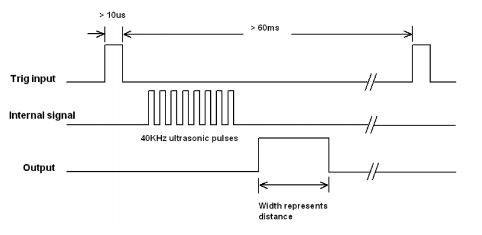

`trig()`함수는 위 그림의 Trig input 신호를 발생시키는 함수이고, `echo()`함수는 위 그림 Output 신호의 펄스폭을 μs값으로 구하는 함수이다. 위 그림에서 눈여겨 봐야할 또 한가지 사항은 첫 번 째 Trig input신호와 두 번 째 Trig input신호 사이의 간격이 60(ms)라는 점이다. 이는 연속해서 `trig()`함수를 호출할 때 적어도 60(ms)이상의 시간간격을 두고 호출해야한다는 뜻이다.

`main.c`의 96~98행의 다음 코드를 찾는다.

```c
/* USER CODE BEGIN 2 */

  /* USER CODE END 2 */
```


위코드를 다음과 같이 수정 편집 후 저장한다.

```c
/* USER CODE BEGIN 2 */
  printf("Mesure Distance with HC-SR04!\n");
      HAL_TIM_Base_Start(&htim2);
  /* USER CODE END 2 */
```


`main.c`의 101~104행의 다음 코드를 찾는다.

```c
/* USER CODE BEGIN WHILE */
  while (1)
  {
    /* USER CODE END WHILE */

```


위코드를 다음과 같이 수정 편집 후 저장한다.

```c
/* USER CODE BEGIN WHILE */
  while (1)
  {
	  trig();
	  uint16_t echo_time = echo();
	  if(echo_time == 0) {
		  printf("out of range!\n");
	  }
	  else {
		  uint16_t dist = 17 * echo_time / 100;
		  printf("distance = %d(mm)\n", dist);
	  }
	  HAL_Delay(100);
    /* USER CODE END WHILE */
```


다음은 위의 모든 편집내용이 반영된 `main.c`전체 코드이다.

```c
/* USER CODE BEGIN Header */
/**
  ******************************************************************************
  * @file           : main.c
  * @brief          : Main program body
  ******************************************************************************
  * @attention
  *
  * Copyright (c) 2026 STMicroelectronics.
  * All rights reserved.
  *
  * This software is licensed under terms that can be found in the LICENSE file
  * in the root directory of this software component.
  * If no LICENSE file comes with this software, it is provided AS-IS.
  *
  ******************************************************************************
  */
/* USER CODE END Header */
/* Includes ------------------------------------------------------------------*/
#include "main.h"

/* Private includes ----------------------------------------------------------*/
/* USER CODE BEGIN Includes */
#include "uart2_printf.h"
#include "delay_us.h"
/* USER CODE END Includes */

/* Private typedef -----------------------------------------------------------*/
/* USER CODE BEGIN PTD */

/* USER CODE END PTD */

/* Private define ------------------------------------------------------------*/
/* USER CODE BEGIN PD */
#define HIGH 1
#define LOW  0
/* USER CODE END PD */

/* Private macro -------------------------------------------------------------*/
/* USER CODE BEGIN PM */

/* USER CODE END PM */

/* Private variables ---------------------------------------------------------*/
TIM_HandleTypeDef htim2;

UART_HandleTypeDef huart2;

/* USER CODE BEGIN PV */

/* USER CODE END PV */

/* Private function prototypes -----------------------------------------------*/
void SystemClock_Config(void);
static void MX_GPIO_Init(void);
static void MX_TIM2_Init(void);
static void MX_USART2_UART_Init(void);
/* USER CODE BEGIN PFP */
void trig(void);
uint16_t echo(void);
/* USER CODE END PFP */

/* Private user code ---------------------------------------------------------*/
/* USER CODE BEGIN 0 */

/* USER CODE END 0 */

/**
  * @brief  The application entry point.
  * @retval int
  */
int main(void)
{

  /* USER CODE BEGIN 1 */

  /* USER CODE END 1 */

  /* MCU Configuration--------------------------------------------------------*/

  /* Reset of all peripherals, Initializes the Flash interface and the Systick. */
  HAL_Init();

  /* USER CODE BEGIN Init */

  /* USER CODE END Init */

  /* Configure the system clock */
  SystemClock_Config();

  /* USER CODE BEGIN SysInit */

  /* USER CODE END SysInit */

  /* Initialize all configured peripherals */
  MX_GPIO_Init();
  MX_TIM2_Init();
  MX_USART2_UART_Init();
  /* USER CODE BEGIN 2 */
    printf("Mesure Distance with HC-SR04!\n");
        HAL_TIM_Base_Start(&htim2);
    /* USER CODE END 2 */

  /* Infinite loop */
  /* USER CODE BEGIN WHILE */
  while (1)
  {
	  trig();
	  uint16_t echo_time = echo();
	  if(echo_time == 0) {
		  printf("out of range!\n");
	  }
	  else {
		  uint16_t dist = 17 * echo_time / 100;
		  printf("distance = %d(mm)\n", dist);
	  }
	  HAL_Delay(100);
    /* USER CODE END WHILE */

    /* USER CODE BEGIN 3 */
  }
  /* USER CODE END 3 */
}

/**
  * @brief System Clock Configuration
  * @retval None
  */
void SystemClock_Config(void)
{
  RCC_OscInitTypeDef RCC_OscInitStruct = {0};
  RCC_ClkInitTypeDef RCC_ClkInitStruct = {0};

  /** Initializes the RCC Oscillators according to the specified parameters
  * in the RCC_OscInitTypeDef structure.
  */
  RCC_OscInitStruct.OscillatorType = RCC_OSCILLATORTYPE_HSI;
  RCC_OscInitStruct.HSIState = RCC_HSI_ON;
  RCC_OscInitStruct.HSICalibrationValue = RCC_HSICALIBRATION_DEFAULT;
  RCC_OscInitStruct.PLL.PLLState = RCC_PLL_ON;
  RCC_OscInitStruct.PLL.PLLSource = RCC_PLLSOURCE_HSI_DIV2;
  RCC_OscInitStruct.PLL.PLLMUL = RCC_PLL_MUL16;
  if (HAL_RCC_OscConfig(&RCC_OscInitStruct) != HAL_OK)
  {
    Error_Handler();
  }

  /** Initializes the CPU, AHB and APB buses clocks
  */
  RCC_ClkInitStruct.ClockType = RCC_CLOCKTYPE_HCLK|RCC_CLOCKTYPE_SYSCLK
                              |RCC_CLOCKTYPE_PCLK1|RCC_CLOCKTYPE_PCLK2;
  RCC_ClkInitStruct.SYSCLKSource = RCC_SYSCLKSOURCE_PLLCLK;
  RCC_ClkInitStruct.AHBCLKDivider = RCC_SYSCLK_DIV1;
  RCC_ClkInitStruct.APB1CLKDivider = RCC_HCLK_DIV2;
  RCC_ClkInitStruct.APB2CLKDivider = RCC_HCLK_DIV1;

  if (HAL_RCC_ClockConfig(&RCC_ClkInitStruct, FLASH_LATENCY_2) != HAL_OK)
  {
    Error_Handler();
  }
}

/**
  * @brief TIM2 Initialization Function
  * @param None
  * @retval None
  */
static void MX_TIM2_Init(void)
{

  /* USER CODE BEGIN TIM2_Init 0 */

  /* USER CODE END TIM2_Init 0 */

  TIM_ClockConfigTypeDef sClockSourceConfig = {0};
  TIM_MasterConfigTypeDef sMasterConfig = {0};

  /* USER CODE BEGIN TIM2_Init 1 */

  /* USER CODE END TIM2_Init 1 */
  htim2.Instance = TIM2;
  htim2.Init.Prescaler = 64-1;
  htim2.Init.CounterMode = TIM_COUNTERMODE_UP;
  htim2.Init.Period = 65535;
  htim2.Init.ClockDivision = TIM_CLOCKDIVISION_DIV1;
  htim2.Init.AutoReloadPreload = TIM_AUTORELOAD_PRELOAD_DISABLE;
  if (HAL_TIM_Base_Init(&htim2) != HAL_OK)
  {
    Error_Handler();
  }
  sClockSourceConfig.ClockSource = TIM_CLOCKSOURCE_INTERNAL;
  if (HAL_TIM_ConfigClockSource(&htim2, &sClockSourceConfig) != HAL_OK)
  {
    Error_Handler();
  }
  sMasterConfig.MasterOutputTrigger = TIM_TRGO_RESET;
  sMasterConfig.MasterSlaveMode = TIM_MASTERSLAVEMODE_DISABLE;
  if (HAL_TIMEx_MasterConfigSynchronization(&htim2, &sMasterConfig) != HAL_OK)
  {
    Error_Handler();
  }
  /* USER CODE BEGIN TIM2_Init 2 */

  /* USER CODE END TIM2_Init 2 */

}

/**
  * @brief USART2 Initialization Function
  * @param None
  * @retval None
  */
static void MX_USART2_UART_Init(void)
{

  /* USER CODE BEGIN USART2_Init 0 */

  /* USER CODE END USART2_Init 0 */

  /* USER CODE BEGIN USART2_Init 1 */

  /* USER CODE END USART2_Init 1 */
  huart2.Instance = USART2;
  huart2.Init.BaudRate = 115200;
  huart2.Init.WordLength = UART_WORDLENGTH_8B;
  huart2.Init.StopBits = UART_STOPBITS_1;
  huart2.Init.Parity = UART_PARITY_NONE;
  huart2.Init.Mode = UART_MODE_TX_RX;
  huart2.Init.HwFlowCtl = UART_HWCONTROL_NONE;
  huart2.Init.OverSampling = UART_OVERSAMPLING_16;
  if (HAL_UART_Init(&huart2) != HAL_OK)
  {
    Error_Handler();
  }
  /* USER CODE BEGIN USART2_Init 2 */

  /* USER CODE END USART2_Init 2 */

}

/**
  * @brief GPIO Initialization Function
  * @param None
  * @retval None
  */
static void MX_GPIO_Init(void)
{
  GPIO_InitTypeDef GPIO_InitStruct = {0};
  /* USER CODE BEGIN MX_GPIO_Init_1 */

  /* USER CODE END MX_GPIO_Init_1 */

  /* GPIO Ports Clock Enable */
  __HAL_RCC_GPIOC_CLK_ENABLE();
  __HAL_RCC_GPIOD_CLK_ENABLE();
  __HAL_RCC_GPIOA_CLK_ENABLE();
  __HAL_RCC_GPIOB_CLK_ENABLE();

  /*Configure GPIO pin Output Level */
  HAL_GPIO_WritePin(LD2_GPIO_Port, LD2_Pin, GPIO_PIN_RESET);

  /*Configure GPIO pin Output Level */
  HAL_GPIO_WritePin(GPIOB, GPIO_PIN_4, GPIO_PIN_RESET);

  /*Configure GPIO pin : B1_Pin */
  GPIO_InitStruct.Pin = B1_Pin;
  GPIO_InitStruct.Mode = GPIO_MODE_IT_RISING;
  GPIO_InitStruct.Pull = GPIO_NOPULL;
  HAL_GPIO_Init(B1_GPIO_Port, &GPIO_InitStruct);

  /*Configure GPIO pin : LD2_Pin */
  GPIO_InitStruct.Pin = LD2_Pin;
  GPIO_InitStruct.Mode = GPIO_MODE_OUTPUT_PP;
  GPIO_InitStruct.Pull = GPIO_NOPULL;
  GPIO_InitStruct.Speed = GPIO_SPEED_FREQ_LOW;
  HAL_GPIO_Init(LD2_GPIO_Port, &GPIO_InitStruct);

  /*Configure GPIO pin : PB4 */
  GPIO_InitStruct.Pin = GPIO_PIN_4;
  GPIO_InitStruct.Mode = GPIO_MODE_OUTPUT_PP;
  GPIO_InitStruct.Pull = GPIO_NOPULL;
  GPIO_InitStruct.Speed = GPIO_SPEED_FREQ_LOW;
  HAL_GPIO_Init(GPIOB, &GPIO_InitStruct);

  /*Configure GPIO pin : PB5 */
  GPIO_InitStruct.Pin = GPIO_PIN_5;
  GPIO_InitStruct.Mode = GPIO_MODE_INPUT;
  GPIO_InitStruct.Pull = GPIO_NOPULL;
  HAL_GPIO_Init(GPIOB, &GPIO_InitStruct);

  /* EXTI interrupt init*/
  HAL_NVIC_SetPriority(EXTI15_10_IRQn, 0, 0);
  HAL_NVIC_EnableIRQ(EXTI15_10_IRQn);

  /* USER CODE BEGIN MX_GPIO_Init_2 */

  /* USER CODE END MX_GPIO_Init_2 */
}

/* USER CODE BEGIN 4 */
void trig()
{
	HAL_GPIO_WritePin(GPIOB, GPIO_PIN_4, HIGH);
	delay_us(10);
	HAL_GPIO_WritePin(GPIOB, GPIO_PIN_4, LOW);
}

uint16_t echo()
{
	uint16_t echo_time = 0;
	uint16_t timeout_start = __HAL_TIM_GET_COUNTER(&htim2);
	while(HAL_GPIO_ReadPin(GPIOB, GPIO_PIN_5)== LOW)
	{
		if ((uint16_t)(__HAL_TIM_GET_COUNTER(&htim2) - timeout_start) > 30000)
		            return 0;
		else;
	}
	uint16_t start = __HAL_TIM_GET_COUNTER(&htim2);
	while(HAL_GPIO_ReadPin(GPIOB, GPIO_PIN_5)== HIGH)
	{
		if ((uint16_t)(__HAL_TIM_GET_COUNTER(&htim2) - start) > 30000)
				            return 0;
		else;
	}
	uint16_t end = __HAL_TIM_GET_COUNTER(&htim2);
	echo_time = (uint16_t)(end - start);
	if( echo_time >= 240 && echo_time <= 23000 )
		return echo_time;
	else
		return 0;
}
/* USER CODE END 4 */

/**
  * @brief  This function is executed in case of error occurrence.
  * @retval None
  */
void Error_Handler(void)
{
  /* USER CODE BEGIN Error_Handler_Debug */
  /* User can add his own implementation to report the HAL error return state */
  __disable_irq();
  while (1)
  {
  }
  /* USER CODE END Error_Handler_Debug */
}
#ifdef USE_FULL_ASSERT
/**
  * @brief  Reports the name of the source file and the source line number
  *         where the assert_param error has occurred.
  * @param  file: pointer to the source file name
  * @param  line: assert_param error line source number
  * @retval None
  */
void assert_failed(uint8_t *file, uint32_t line)
{
  /* USER CODE BEGIN 6 */
  /* User can add his own implementation to report the file name and line number,
     ex: printf("Wrong parameters value: file %s on line %d\r\n", file, line) */
  /* USER CODE END 6 */
}
#endif /* USE_FULL_ASSERT */

```


**STM32CubeIDE**의 **Project** 메뉴의 **Build Project** 항목을 클릭하여 프로젝트를 빌드한다. 


이제 앞서 빌드한 결과를 타겟보드에 올려 동작 시켜보자. **STM32CubeIDE**의 **Run**메뉴의 **Run**항목을 클릭한다.

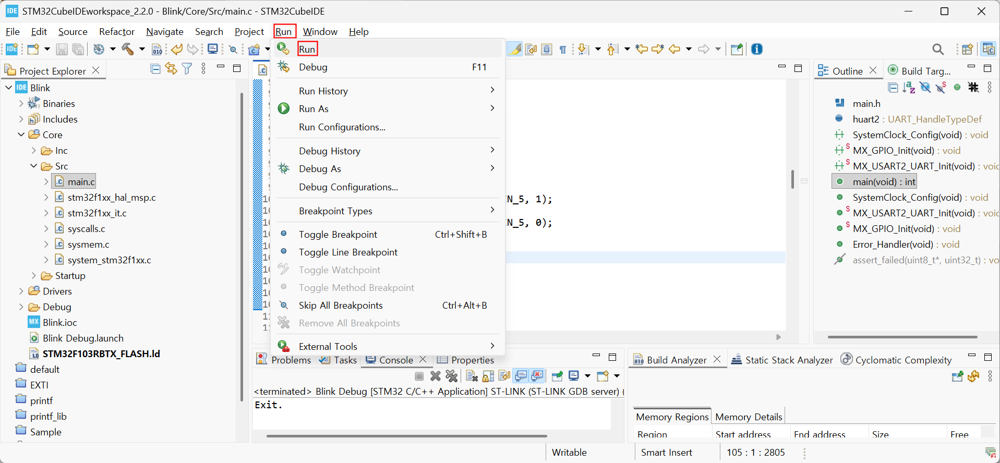

시리얼 통신 에뮬레이터를 통해 HC-SR04 초음파 센서로 측정한 거리가 시리얼 통신으로 수신되는지 확인해보자. 우선 타겟보드가 연결된 포트번호를 확인해야 한다.

 

 + `R` 을 입력하여 열린 실행 창에 `devmgmt.msc`  입력 후, [ 확인 ] 버튼을 클릭하여 장치관리자를 연 후,  NUCLEO-F103RB가 연결된 COM 포트 번호를 확인한다.


이제 적당한 시리얼 통신 에뮬레이터 프로그램( **[Putty](https://www.chiark.greenend.org.uk/~sgtatham/putty/latest.html)**, **[Tera Term](https://teratermproject.github.io/index-en.html)** 등 )에서 포트 COM3을 Baudrate 115200 으로 열어 HC-SR04 초음파센서로 측정된 거리가 수신되는 것을 확인한다.

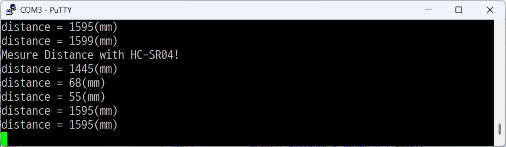


[**목차**](../../README.md) 
