### 서보모터 제어(PWM)

**TIM2 타이머의 Channel 1의 PWM Generation 기능을 이용한 서보(Servo)모터 제어**

**1 결선(Wiring)**

아래 그림을 참고하여 서보1은 TIM2의 CHANNEL1(PA0에 연결한다. 일반적으로 서보모터에는 3가닥(Red, Brown, Orange)의 케이블이 연결되어 있다. Red는 5V, Brown은 GND, Orange는 PWM 출력 채널에 연결한다. 

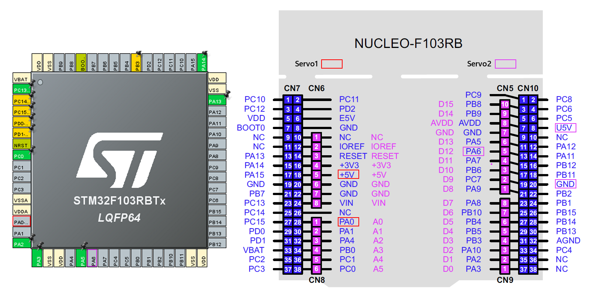

#### 개발 환경

**OS:** MS Windows11

**타겟보드:** NUCLEO-F103RB

**SW Tools:** [STM32CubeMX 6.18.1](https://www.st.com/en/development-tools/stm32cubemx.html) / [STM32CubeIDE 2.20](https://www.st.com/en/development-tools/stm32cubeide.html)

---

**CubeMX에서 설정할 Peripheral**

**- RCC** HSE와와 LSE를 Disable시켜 HSI( 8MHz )를 클럭소스로 설정한다.

**- TIM2 & TIM3** 두 타이머 모두 Channel1으로 20(ms)주기의 PWM을 출력시키도록 설정한다.

새로운 STM32 프로젝트 생성을 위해 STM32CubeMX 실행 후, 타겟 설정을 위해 **ACCESS TO BOARD SELECTOR**를 클릭한다.


New Project from Board 화면의 **PRODUCT INFO**의 **Type**에서 **Nucleo-64**를 체크한다. 


New Project fron Board 화면의 **PRODUCT INFO**를 스크롤다운해서 **MCU/MPU Series**에서 **STM32F1**을 체크하면 화면 우측의 **Board List**가 확 줄어든 것을 볼 수 있다. 그 중에서 타겟보드로 사용중인 **NUCLEO-F103RB**를 선택 후 화면 오른쪽 상단의 **Start Project**를 클릭한다.


위 모든 주변장치들을 기본 모드로 초기화 하겠냐는 팝업창에서 	[ Yes ]를 클릭하면

**GPIO** **PA5**는 Output Push pull로,  **PC13**은 External Interrupt Mode with Rising edge trigger detection으로 설정되고

**USART2**는 **Baudrate**115200,  **Parity** none, **Data** 8bit, **Stop** 1bit가 **default**(기본값)로 설정된다.


최우선으로 설정해야 하는 것은 **RCC** 설정이다. **Pinout & Configuration**탭에서 **System Core**를 선택 후,  **RCC**를 클릭하고 바로 우측의 RCC Mode and Configuration의 Mode에서 High Speed Clock(HSE)와 Low Speed Clock(LSE)를 모두 Disable로 설정한다. 이는 모든 외부 클럭을 Disable시킨 것으로 **HSI**(High Speed Internal Clock)를 클럭 소스로 사용하겠다는 의미이다.


CLOCK설정 확인을 위해 **Clock Configuration**탭을 클릭하여 최초 **HSI**(High Speed Internal Clock) 8MHz를 소스 클럭으로 시작하여 64MHz의 시스템 클럭으로 공급되는 것을 확인한다.


 **3 TIM2 설정** TIM2 PWM 출력 채널 1번(PA0)으로 50(ms)주기의 PWM이 출력되도록 설정

  Pinout & Configuration탭의 Timers의 하위항목 중 Tim2를 선택한다.  Tim4 Mode and Configuration의 Mode에서 Internal Clock을 체크, Channel1을 PWM Generation CH1로 변경 후, 화면 우측의 Pinout view 탭에서 PA0 핀을 클릭하여 TIM2_CH1이 나타나는 지 확인 , 선택한다. 

  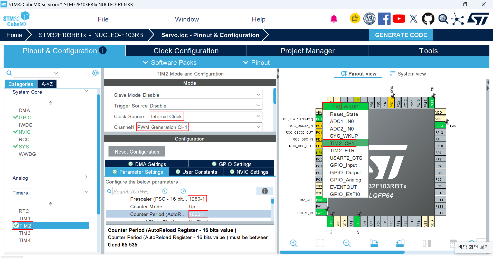

  Tim4의 Congiguration의 arameter Settings 탭의 Prescaler,  Counter Period 설정에 앞서 Clock을 확인해야 한다. 

  STM32-F1xx 시리즈 MCU는 CPU와  다수의 peripheral 장치들로 이루어져 있으며, 이들은 ARMBA( Advanced Microcontroller Bus Architecture ) 버스로 연결되어 있다. 

  ARMBA( Advanced Microcontroller Bus Architecture ) 버스는 AHB(Advanced High Performance Bus), APB1(Advanced Peripheral Bus1 ), APB2( Advanced Peripheral Bus2 ) 의 3가지 BUS로 이루어지며, 다음은 각 Peripheral Device들이 어떤 버스에 연결되어 있는가를 보여주는  구성도이다. 

  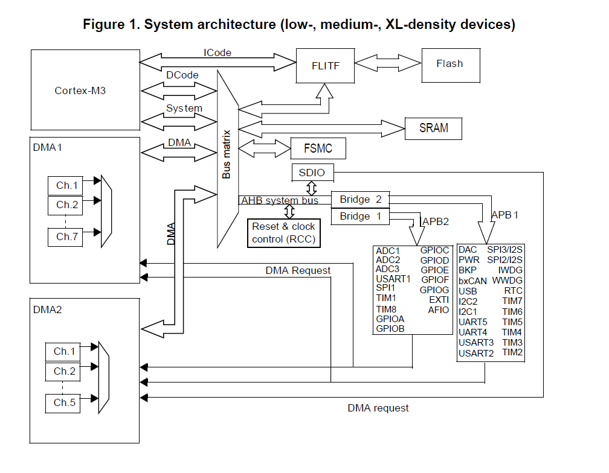

​    서보모터를 제어하기위한 PWM 파형을 TIM2 타이머의 PWM 출력 채널1를 통해 발생시키기 위해 TIM2가 연결된 APB1 버스에 공급되는 클럭 주파수를 확인해야한다.  Clock Configuration 탭을 선택한다.

  APB1 Timer Clock이 64(MHz)라는 것을 확인할 수 있다. 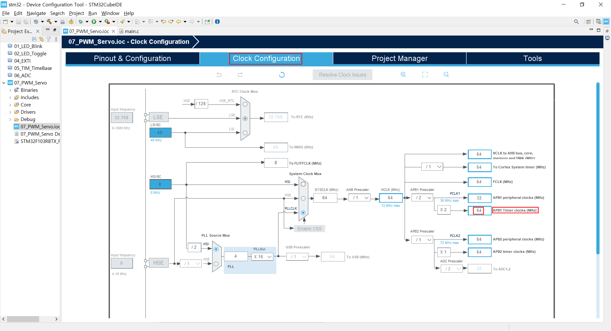

  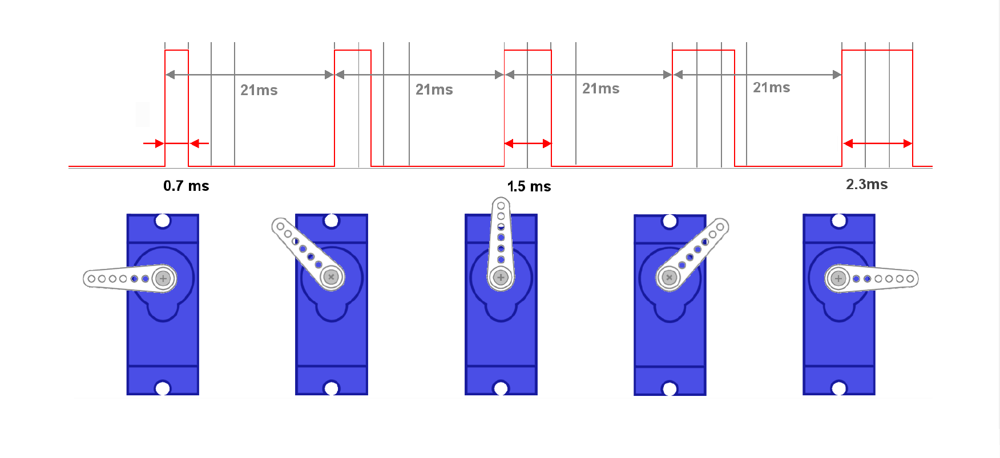

  서보모터를 제어하기위해서는 주기가 20(ms) 즉 50(Hz)인 PWM 파형이 필요하다. Tim2 Mode and Configuration에서 Parameter Settings의 Prescaler와 Counter Period에 적절한 값을 설정하여 이를 맞춰줘야 한다. 

  Tim4에는 64(MHz) 클럭이 공급되는 것은 이미 확인 했다. 이 클럭은은 Prescaler에 의해 분주되어 타이머에 공급된다. 64(MHz)는 64,000,000Hz 인데 Prescaler Parameter를 1280으로 설정한다면, 타이머에는 64,000,000 / 1280 = 50,000(Hz)의 클럭이 공급된다. 이 때 타이머는 카운터로 동작하며, 입력되는 클럭을 카운트한다. 1초에 50,000개의 클럭이 입력되므로, 클럭 1개를 카운트 하는 데에 1/50,000초가 소요된다. 이 때 Counter Periode Parameter로 1,000을 설정한다면 클럭을 1,000번 카운트 할 때 마다 타이머 인터럽트를 발생시키게 된다. 따라서 이 때의 인터럽트 주기는 1/50,000초 × 1,000 = 1,000/50,000=1/50=2/100 초, 즉 20(ms)가 되어 서보모터를 제어하기위한 주기 20(ms)인 PWM 파형을 발생시킬 준비가 되었다. 이를 바탕으로 TIM2 타이머의 Parameter들을 설정해보자.


여기까지 설정을 반영한 코드 생성을위해 **Generate Code**를 클릭 하기 전, 우선 **Project Manager** 탭을 클릭한다. 


아래와 같이 Project Manager 화면이 열린다.

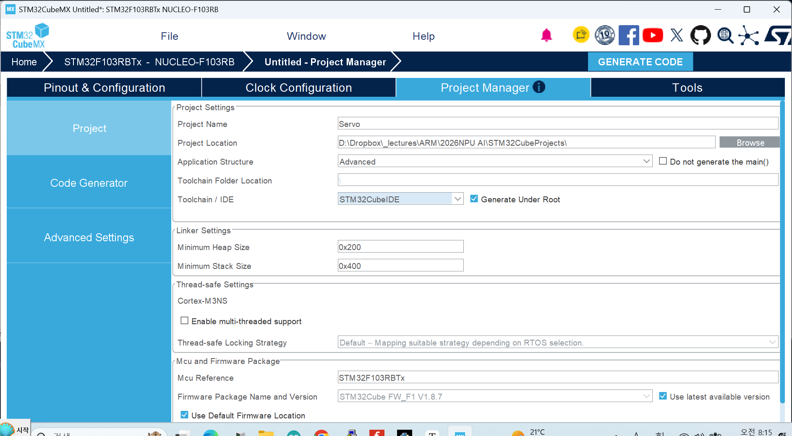

**1. Project Location** : [Browse]버튼을 클릭하여 앞서 **STM32CubeMX**에서 생성한 프로젝트들을 저장하기위해 만들어 둔 **STM32CubeProjects** 폴더를 지정한다. 이 작업이 선행되어야 다음 단계에서 입력한 **Project Name**과 같은 이름의 폴더가 이 위치에 생성될 수 있다.

**2. Project Name** :프로젝트 이름을 영문, 숫자 조합으로 작성(한글×)한다.

**3. Toolchain / IDE** : STM32CubeIDE를 선택한다.( **매우 중요함.** 잘못 지정되어 있을 경우 **STM32CubeIDE**에서 프로젝트가 열리지 않는다. )

**4. GENERATE CODE**를 클릭한다.


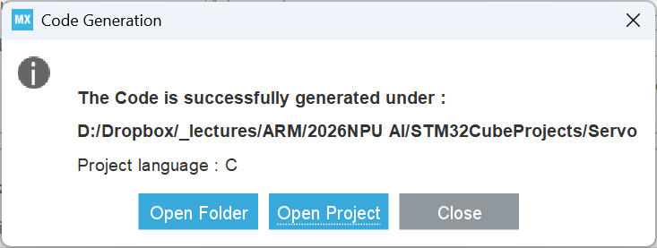

위 The Code is successfully generated... 팝업 메세지 창에서 **[ Open Project ]** 를 클릭하면 Project Manager에서 Toolchain / IDE로 지정한 **STM32CubeIDE**가 자동 실행되며 해당 프로젝트가 **STM32CubeIDE**의 워크스페이스에 성공적으로 Import되었다는 팝업과 함께 Project Explore에 해당 프로젝트가 열린다.

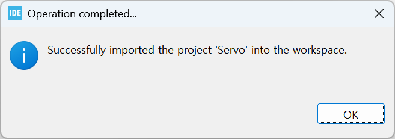

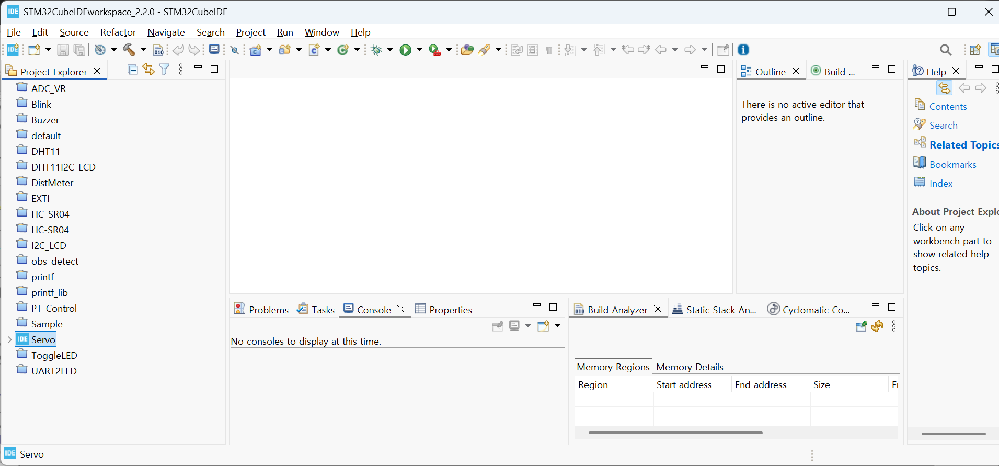


**Project Explorer**에서 **Blink** > **Core** > **Src** > **main.c** 순서로 각 항목을 확장시켜 **main.c**를 연다.

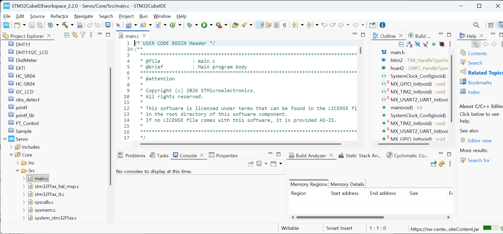

`user_lib`폴더의 사용자 정의 라이브러리들 중 `uart2_printf.h`를 PT_Control프로젝트 폴더의 Core-Inc 폴더에, `uart2_printf.c`를 PT_Control프로젝트 폴더의 Core-Src 폴더에 복사 후 Project Explorer에서 PT_Control프로젝트 선택 후 [F5]키를 눌러 Refresh시킨다.

**STM32CubeIDE** 의 **Project**메뉴의 **Build Project**항목을 클릭하여 테스트 빌드를 수행한다.


다음은 **STM32CubeMX**에서 **PT_Control**프로젝트에 대해 자동 생성한 **main.c**의 내용이다.

```c
/* USER CODE BEGIN Header */
/**
  ******************************************************************************
  * @file           : main.c
  * @brief          : Main program body
  ******************************************************************************
  * @attention
  *
  * Copyright (c) 2026 STMicroelectronics.
  * All rights reserved.
  *
  * This software is licensed under terms that can be found in the LICENSE file
  * in the root directory of this software component.
  * If no LICENSE file comes with this software, it is provided AS-IS.
  *
  ******************************************************************************
  */
/* USER CODE END Header */
/* Includes ------------------------------------------------------------------*/
#include "main.h"

/* Private includes ----------------------------------------------------------*/
/* USER CODE BEGIN Includes */

/* USER CODE END Includes */

/* Private typedef -----------------------------------------------------------*/
/* USER CODE BEGIN PTD */

/* USER CODE END PTD */

/* Private define ------------------------------------------------------------*/
/* USER CODE BEGIN PD */

/* USER CODE END PD */

/* Private macro -------------------------------------------------------------*/
/* USER CODE BEGIN PM */

/* USER CODE END PM */

/* Private variables ---------------------------------------------------------*/
TIM_HandleTypeDef htim2;

UART_HandleTypeDef huart2;

/* USER CODE BEGIN PV */

/* USER CODE END PV */

/* Private function prototypes -----------------------------------------------*/
void SystemClock_Config(void);
static void MX_GPIO_Init(void);
static void MX_TIM2_Init(void);
static void MX_USART2_UART_Init(void);
/* USER CODE BEGIN PFP */

/* USER CODE END PFP */

/* Private user code ---------------------------------------------------------*/
/* USER CODE BEGIN 0 */

/* USER CODE END 0 */

/**
  * @brief  The application entry point.
  * @retval int
  */
int main(void)
{

  /* USER CODE BEGIN 1 */

  /* USER CODE END 1 */

  /* MCU Configuration--------------------------------------------------------*/

  /* Reset of all peripherals, Initializes the Flash interface and the Systick. */
  HAL_Init();

  /* USER CODE BEGIN Init */

  /* USER CODE END Init */

  /* Configure the system clock */
  SystemClock_Config();

  /* USER CODE BEGIN SysInit */

  /* USER CODE END SysInit */

  /* Initialize all configured peripherals */
  MX_GPIO_Init();
  MX_TIM2_Init();
  MX_USART2_UART_Init();
  /* USER CODE BEGIN 2 */

  /* USER CODE END 2 */

  /* Infinite loop */
  /* USER CODE BEGIN WHILE */
  while (1)
  {
    /* USER CODE END WHILE */

    /* USER CODE BEGIN 3 */
  }
  /* USER CODE END 3 */
}

/**
  * @brief System Clock Configuration
  * @retval None
  */
void SystemClock_Config(void)
{
  RCC_OscInitTypeDef RCC_OscInitStruct = {0};
  RCC_ClkInitTypeDef RCC_ClkInitStruct = {0};

  /** Initializes the RCC Oscillators according to the specified parameters
  * in the RCC_OscInitTypeDef structure.
  */
  RCC_OscInitStruct.OscillatorType = RCC_OSCILLATORTYPE_HSI;
  RCC_OscInitStruct.HSIState = RCC_HSI_ON;
  RCC_OscInitStruct.HSICalibrationValue = RCC_HSICALIBRATION_DEFAULT;
  RCC_OscInitStruct.PLL.PLLState = RCC_PLL_ON;
  RCC_OscInitStruct.PLL.PLLSource = RCC_PLLSOURCE_HSI_DIV2;
  RCC_OscInitStruct.PLL.PLLMUL = RCC_PLL_MUL16;
  if (HAL_RCC_OscConfig(&RCC_OscInitStruct) != HAL_OK)
  {
    Error_Handler();
  }

  /** Initializes the CPU, AHB and APB buses clocks
  */
  RCC_ClkInitStruct.ClockType = RCC_CLOCKTYPE_HCLK|RCC_CLOCKTYPE_SYSCLK
                              |RCC_CLOCKTYPE_PCLK1|RCC_CLOCKTYPE_PCLK2;
  RCC_ClkInitStruct.SYSCLKSource = RCC_SYSCLKSOURCE_PLLCLK;
  RCC_ClkInitStruct.AHBCLKDivider = RCC_SYSCLK_DIV1;
  RCC_ClkInitStruct.APB1CLKDivider = RCC_HCLK_DIV2;
  RCC_ClkInitStruct.APB2CLKDivider = RCC_HCLK_DIV1;

  if (HAL_RCC_ClockConfig(&RCC_ClkInitStruct, FLASH_LATENCY_2) != HAL_OK)
  {
    Error_Handler();
  }
}

/**
  * @brief TIM2 Initialization Function
  * @param None
  * @retval None
  */
static void MX_TIM2_Init(void)
{

  /* USER CODE BEGIN TIM2_Init 0 */

  /* USER CODE END TIM2_Init 0 */

  TIM_ClockConfigTypeDef sClockSourceConfig = {0};
  TIM_MasterConfigTypeDef sMasterConfig = {0};
  TIM_OC_InitTypeDef sConfigOC = {0};

  /* USER CODE BEGIN TIM2_Init 1 */

  /* USER CODE END TIM2_Init 1 */
  htim2.Instance = TIM2;
  htim2.Init.Prescaler = 0;
  htim2.Init.CounterMode = TIM_COUNTERMODE_UP;
  htim2.Init.Period = 65535;
  htim2.Init.ClockDivision = TIM_CLOCKDIVISION_DIV1;
  htim2.Init.AutoReloadPreload = TIM_AUTORELOAD_PRELOAD_DISABLE;
  if (HAL_TIM_Base_Init(&htim2) != HAL_OK)
  {
    Error_Handler();
  }
  sClockSourceConfig.ClockSource = TIM_CLOCKSOURCE_INTERNAL;
  if (HAL_TIM_ConfigClockSource(&htim2, &sClockSourceConfig) != HAL_OK)
  {
    Error_Handler();
  }
  if (HAL_TIM_PWM_Init(&htim2) != HAL_OK)
  {
    Error_Handler();
  }
  sMasterConfig.MasterOutputTrigger = TIM_TRGO_RESET;
  sMasterConfig.MasterSlaveMode = TIM_MASTERSLAVEMODE_DISABLE;
  if (HAL_TIMEx_MasterConfigSynchronization(&htim2, &sMasterConfig) != HAL_OK)
  {
    Error_Handler();
  }
  sConfigOC.OCMode = TIM_OCMODE_PWM1;
  sConfigOC.Pulse = 0;
  sConfigOC.OCPolarity = TIM_OCPOLARITY_HIGH;
  sConfigOC.OCFastMode = TIM_OCFAST_DISABLE;
  if (HAL_TIM_PWM_ConfigChannel(&htim2, &sConfigOC, TIM_CHANNEL_1) != HAL_OK)
  {
    Error_Handler();
  }
  /* USER CODE BEGIN TIM2_Init 2 */

  /* USER CODE END TIM2_Init 2 */
  HAL_TIM_MspPostInit(&htim2);

}

/**
  * @brief USART2 Initialization Function
  * @param None
  * @retval None
  */
static void MX_USART2_UART_Init(void)
{

  /* USER CODE BEGIN USART2_Init 0 */

  /* USER CODE END USART2_Init 0 */

  /* USER CODE BEGIN USART2_Init 1 */

  /* USER CODE END USART2_Init 1 */
  huart2.Instance = USART2;
  huart2.Init.BaudRate = 115200;
  huart2.Init.WordLength = UART_WORDLENGTH_8B;
  huart2.Init.StopBits = UART_STOPBITS_1;
  huart2.Init.Parity = UART_PARITY_NONE;
  huart2.Init.Mode = UART_MODE_TX_RX;
  huart2.Init.HwFlowCtl = UART_HWCONTROL_NONE;
  huart2.Init.OverSampling = UART_OVERSAMPLING_16;
  if (HAL_UART_Init(&huart2) != HAL_OK)
  {
    Error_Handler();
  }
  /* USER CODE BEGIN USART2_Init 2 */

  /* USER CODE END USART2_Init 2 */

}

/**
  * @brief GPIO Initialization Function
  * @param None
  * @retval None
  */
static void MX_GPIO_Init(void)
{
  GPIO_InitTypeDef GPIO_InitStruct = {0};
  /* USER CODE BEGIN MX_GPIO_Init_1 */

  /* USER CODE END MX_GPIO_Init_1 */

  /* GPIO Ports Clock Enable */
  __HAL_RCC_GPIOC_CLK_ENABLE();
  __HAL_RCC_GPIOD_CLK_ENABLE();
  __HAL_RCC_GPIOA_CLK_ENABLE();
  __HAL_RCC_GPIOB_CLK_ENABLE();

  /*Configure GPIO pin Output Level */
  HAL_GPIO_WritePin(LD2_GPIO_Port, LD2_Pin, GPIO_PIN_RESET);

  /*Configure GPIO pin : B1_Pin */
  GPIO_InitStruct.Pin = B1_Pin;
  GPIO_InitStruct.Mode = GPIO_MODE_IT_RISING;
  GPIO_InitStruct.Pull = GPIO_NOPULL;
  HAL_GPIO_Init(B1_GPIO_Port, &GPIO_InitStruct);

  /*Configure GPIO pin : LD2_Pin */
  GPIO_InitStruct.Pin = LD2_Pin;
  GPIO_InitStruct.Mode = GPIO_MODE_OUTPUT_PP;
  GPIO_InitStruct.Pull = GPIO_NOPULL;
  GPIO_InitStruct.Speed = GPIO_SPEED_FREQ_LOW;
  HAL_GPIO_Init(LD2_GPIO_Port, &GPIO_InitStruct);

  /* EXTI interrupt init*/
  HAL_NVIC_SetPriority(EXTI15_10_IRQn, 0, 0);
  HAL_NVIC_EnableIRQ(EXTI15_10_IRQn);

  /* USER CODE BEGIN MX_GPIO_Init_2 */

  /* USER CODE END MX_GPIO_Init_2 */
}

/* USER CODE BEGIN 4 */

/* USER CODE END 4 */

/**
  * @brief  This function is executed in case of error occurrence.
  * @retval None
  */
void Error_Handler(void)
{
  /* USER CODE BEGIN Error_Handler_Debug */
  /* User can add his own implementation to report the HAL error return state */
  __disable_irq();
  while (1)
  {
  }
  /* USER CODE END Error_Handler_Debug */
}
#ifdef USE_FULL_ASSERT
/**
  * @brief  Reports the name of the source file and the source line number
  *         where the assert_param error has occurred.
  * @param  file: pointer to the source file name
  * @param  line: assert_param error line source number
  * @retval None
  */
void assert_failed(uint8_t *file, uint32_t line)
{
  /* USER CODE BEGIN 6 */
  /* User can add his own implementation to report the file name and line number,
     ex: printf("Wrong parameters value: file %s on line %d\r\n", file, line) */
  /* USER CODE END 6 */
}
#endif /* USE_FULL_ASSERT */

```


`main.c`의 23~25행의 다음코드를

```c
/* USER CODE BEGIN Includes */

/* USER CODE END Includes */
```

아래와 같이 수정한다. 

```c
/* USER CODE BEGIN Includes */
#include "uart2_printf.h"
/* USER CODE END Includes */
```


`main.c`의 96~98행의 다음코드를

```c
/* USER CODE BEGIN 2 */

/* USER CODE END 2 */
```

아래와 같이 수정한다. 

```c
 /* USER CODE BEGIN 2 */
  printf("Servo Control!\n");
  HAL_TIM_PWM_Start(&htim2,TIM_CHANNEL_1);
  __HAL_TIM_SetCompare(&htim2, TIM_CHANNEL_1, 75);
HAL_Delay(10);
  /* USER CODE END 2 */
```


`main.c`의 104~108행의 다음코드를 `main.c`의 다음코드를 

```c
/* USER CODE BEGIN WHILE */
  while (1)
  {
    /* USER CODE END WHILE */
```

아래와 같이 수정한다. 


```c
/* USER CODE BEGIN WHILE */
  while (1)
  {
      __HAL_TIM_SetCompare(&htim2, TIM_CHANNEL_1, 25);
    HAL_Delay(1000);
      __HAL_TIM_SetCompare(&htim2, TIM_CHANNEL_1, 125);
    HAL_Delay(1000);
    /* USER CODE END WHILE */
```


다음은 편집이 완료된 `main.c`의 전체 코드이다.

```c
/* USER CODE BEGIN Header */
/**
  ******************************************************************************
  * @file           : main.c
  * @brief          : Main program body
  ******************************************************************************
  * @attention
  *
  * Copyright (c) 2026 STMicroelectronics.
  * All rights reserved.
  *
  * This software is licensed under terms that can be found in the LICENSE file
  * in the root directory of this software component.
  * If no LICENSE file comes with this software, it is provided AS-IS.
  *
  ******************************************************************************
  */
/* USER CODE END Header */
/* Includes ------------------------------------------------------------------*/
#include "main.h"

/* Private includes ----------------------------------------------------------*/
/* USER CODE BEGIN Includes */
#include "uart2_printf.h"
/* USER CODE END Includes */

/* Private typedef -----------------------------------------------------------*/
/* USER CODE BEGIN PTD */

/* USER CODE END PTD */

/* Private define ------------------------------------------------------------*/
/* USER CODE BEGIN PD */

/* USER CODE END PD */

/* Private macro -------------------------------------------------------------*/
/* USER CODE BEGIN PM */

/* USER CODE END PM */

/* Private variables ---------------------------------------------------------*/
TIM_HandleTypeDef htim2;

UART_HandleTypeDef huart2;

/* USER CODE BEGIN PV */

/* USER CODE END PV */

/* Private function prototypes -----------------------------------------------*/
void SystemClock_Config(void);
static void MX_GPIO_Init(void);
static void MX_TIM2_Init(void);
static void MX_USART2_UART_Init(void);
/* USER CODE BEGIN PFP */

/* USER CODE END PFP */

/* Private user code ---------------------------------------------------------*/
/* USER CODE BEGIN 0 */

/* USER CODE END 0 */

/**
  * @brief  The application entry point.
  * @retval int
  */
int main(void)
{

  /* USER CODE BEGIN 1 */

  /* USER CODE END 1 */

  /* MCU Configuration--------------------------------------------------------*/

  /* Reset of all peripherals, Initializes the Flash interface and the Systick. */
  HAL_Init();

  /* USER CODE BEGIN Init */

  /* USER CODE END Init */

  /* Configure the system clock */
  SystemClock_Config();

  /* USER CODE BEGIN SysInit */

  /* USER CODE END SysInit */

  /* Initialize all configured peripherals */
  MX_GPIO_Init();
  MX_TIM2_Init();
  MX_USART2_UART_Init();
  /* USER CODE BEGIN 2 */
   printf("Servo Control!\n");
   HAL_TIM_PWM_Start(&htim2,TIM_CHANNEL_1);
   __HAL_TIM_SetCompare(&htim2, TIM_CHANNEL_1, 75);
 HAL_Delay(10);
  /* USER CODE END 2 */

  /* Infinite loop */
  /* USER CODE BEGIN WHILE */
   while (1)
   {
       __HAL_TIM_SetCompare(&htim2, TIM_CHANNEL_1, 25);
     HAL_Delay(1000);
       __HAL_TIM_SetCompare(&htim2, TIM_CHANNEL_1, 125);
     HAL_Delay(1000);
    /* USER CODE END WHILE */

    /* USER CODE BEGIN 3 */
  }
  /* USER CODE END 3 */
}

/**
  * @brief System Clock Configuration
  * @retval None
  */
void SystemClock_Config(void)
{
  RCC_OscInitTypeDef RCC_OscInitStruct = {0};
  RCC_ClkInitTypeDef RCC_ClkInitStruct = {0};

  /** Initializes the RCC Oscillators according to the specified parameters
  * in the RCC_OscInitTypeDef structure.
  */
  RCC_OscInitStruct.OscillatorType = RCC_OSCILLATORTYPE_HSI;
  RCC_OscInitStruct.HSIState = RCC_HSI_ON;
  RCC_OscInitStruct.HSICalibrationValue = RCC_HSICALIBRATION_DEFAULT;
  RCC_OscInitStruct.PLL.PLLState = RCC_PLL_ON;
  RCC_OscInitStruct.PLL.PLLSource = RCC_PLLSOURCE_HSI_DIV2;
  RCC_OscInitStruct.PLL.PLLMUL = RCC_PLL_MUL16;
  if (HAL_RCC_OscConfig(&RCC_OscInitStruct) != HAL_OK)
  {
    Error_Handler();
  }

  /** Initializes the CPU, AHB and APB buses clocks
  */
  RCC_ClkInitStruct.ClockType = RCC_CLOCKTYPE_HCLK|RCC_CLOCKTYPE_SYSCLK
                              |RCC_CLOCKTYPE_PCLK1|RCC_CLOCKTYPE_PCLK2;
  RCC_ClkInitStruct.SYSCLKSource = RCC_SYSCLKSOURCE_PLLCLK;
  RCC_ClkInitStruct.AHBCLKDivider = RCC_SYSCLK_DIV1;
  RCC_ClkInitStruct.APB1CLKDivider = RCC_HCLK_DIV2;
  RCC_ClkInitStruct.APB2CLKDivider = RCC_HCLK_DIV1;

  if (HAL_RCC_ClockConfig(&RCC_ClkInitStruct, FLASH_LATENCY_2) != HAL_OK)
  {
    Error_Handler();
  }
}

/**
  * @brief TIM2 Initialization Function
  * @param None
  * @retval None
  */
static void MX_TIM2_Init(void)
{

  /* USER CODE BEGIN TIM2_Init 0 */

  /* USER CODE END TIM2_Init 0 */

  TIM_ClockConfigTypeDef sClockSourceConfig = {0};
  TIM_MasterConfigTypeDef sMasterConfig = {0};
  TIM_OC_InitTypeDef sConfigOC = {0};

  /* USER CODE BEGIN TIM2_Init 1 */

  /* USER CODE END TIM2_Init 1 */
  htim2.Instance = TIM2;
  htim2.Init.Prescaler = 1280-1;
  htim2.Init.CounterMode = TIM_COUNTERMODE_UP;
  htim2.Init.Period = 1000-1;
  htim2.Init.ClockDivision = TIM_CLOCKDIVISION_DIV1;
  htim2.Init.AutoReloadPreload = TIM_AUTORELOAD_PRELOAD_DISABLE;
  if (HAL_TIM_Base_Init(&htim2) != HAL_OK)
  {
    Error_Handler();
  }
  sClockSourceConfig.ClockSource = TIM_CLOCKSOURCE_INTERNAL;
  if (HAL_TIM_ConfigClockSource(&htim2, &sClockSourceConfig) != HAL_OK)
  {
    Error_Handler();
  }
  if (HAL_TIM_PWM_Init(&htim2) != HAL_OK)
  {
    Error_Handler();
  }
  sMasterConfig.MasterOutputTrigger = TIM_TRGO_RESET;
  sMasterConfig.MasterSlaveMode = TIM_MASTERSLAVEMODE_DISABLE;
  if (HAL_TIMEx_MasterConfigSynchronization(&htim2, &sMasterConfig) != HAL_OK)
  {
    Error_Handler();
  }
  sConfigOC.OCMode = TIM_OCMODE_PWM1;
  sConfigOC.Pulse = 0;
  sConfigOC.OCPolarity = TIM_OCPOLARITY_HIGH;
  sConfigOC.OCFastMode = TIM_OCFAST_DISABLE;
  if (HAL_TIM_PWM_ConfigChannel(&htim2, &sConfigOC, TIM_CHANNEL_1) != HAL_OK)
  {
    Error_Handler();
  }
  /* USER CODE BEGIN TIM2_Init 2 */

  /* USER CODE END TIM2_Init 2 */
  HAL_TIM_MspPostInit(&htim2);

}

/**
  * @brief USART2 Initialization Function
  * @param None
  * @retval None
  */
static void MX_USART2_UART_Init(void)
{

  /* USER CODE BEGIN USART2_Init 0 */

  /* USER CODE END USART2_Init 0 */

  /* USER CODE BEGIN USART2_Init 1 */

  /* USER CODE END USART2_Init 1 */
  huart2.Instance = USART2;
  huart2.Init.BaudRate = 115200;
  huart2.Init.WordLength = UART_WORDLENGTH_8B;
  huart2.Init.StopBits = UART_STOPBITS_1;
  huart2.Init.Parity = UART_PARITY_NONE;
  huart2.Init.Mode = UART_MODE_TX_RX;
  huart2.Init.HwFlowCtl = UART_HWCONTROL_NONE;
  huart2.Init.OverSampling = UART_OVERSAMPLING_16;
  if (HAL_UART_Init(&huart2) != HAL_OK)
  {
    Error_Handler();
  }
  /* USER CODE BEGIN USART2_Init 2 */

  /* USER CODE END USART2_Init 2 */

}

/**
  * @brief GPIO Initialization Function
  * @param None
  * @retval None
  */
static void MX_GPIO_Init(void)
{
  GPIO_InitTypeDef GPIO_InitStruct = {0};
  /* USER CODE BEGIN MX_GPIO_Init_1 */

  /* USER CODE END MX_GPIO_Init_1 */

  /* GPIO Ports Clock Enable */
  __HAL_RCC_GPIOC_CLK_ENABLE();
  __HAL_RCC_GPIOD_CLK_ENABLE();
  __HAL_RCC_GPIOA_CLK_ENABLE();
  __HAL_RCC_GPIOB_CLK_ENABLE();

  /*Configure GPIO pin Output Level */
  HAL_GPIO_WritePin(LD2_GPIO_Port, LD2_Pin, GPIO_PIN_RESET);

  /*Configure GPIO pin : B1_Pin */
  GPIO_InitStruct.Pin = B1_Pin;
  GPIO_InitStruct.Mode = GPIO_MODE_IT_RISING;
  GPIO_InitStruct.Pull = GPIO_NOPULL;
  HAL_GPIO_Init(B1_GPIO_Port, &GPIO_InitStruct);

  /*Configure GPIO pin : LD2_Pin */
  GPIO_InitStruct.Pin = LD2_Pin;
  GPIO_InitStruct.Mode = GPIO_MODE_OUTPUT_PP;
  GPIO_InitStruct.Pull = GPIO_NOPULL;
  GPIO_InitStruct.Speed = GPIO_SPEED_FREQ_LOW;
  HAL_GPIO_Init(LD2_GPIO_Port, &GPIO_InitStruct);

  /* EXTI interrupt init*/
  HAL_NVIC_SetPriority(EXTI15_10_IRQn, 0, 0);
  HAL_NVIC_EnableIRQ(EXTI15_10_IRQn);

  /* USER CODE BEGIN MX_GPIO_Init_2 */

  /* USER CODE END MX_GPIO_Init_2 */
}

/* USER CODE BEGIN 4 */

/* USER CODE END 4 */

/**
  * @brief  This function is executed in case of error occurrence.
  * @retval None
  */
void Error_Handler(void)
{
  /* USER CODE BEGIN Error_Handler_Debug */
  /* User can add his own implementation to report the HAL error return state */
  __disable_irq();
  while (1)
  {
  }
  /* USER CODE END Error_Handler_Debug */
}
#ifdef USE_FULL_ASSERT
/**
  * @brief  Reports the name of the source file and the source line number
  *         where the assert_param error has occurred.
  * @param  file: pointer to the source file name
  * @param  line: assert_param error line source number
  * @retval None
  */
void assert_failed(uint8_t *file, uint32_t line)
{
  /* USER CODE BEGIN 6 */
  /* User can add his own implementation to report the file name and line number,
     ex: printf("Wrong parameters value: file %s on line %d\r\n", file, line) */
  /* USER CODE END 6 */
}
#endif /* USE_FULL_ASSERT */

```


**STM32CubeIDE**의 **Project** 메뉴의 **Build Project** 항목을 클릭하여 프로젝트를 빌드한다. 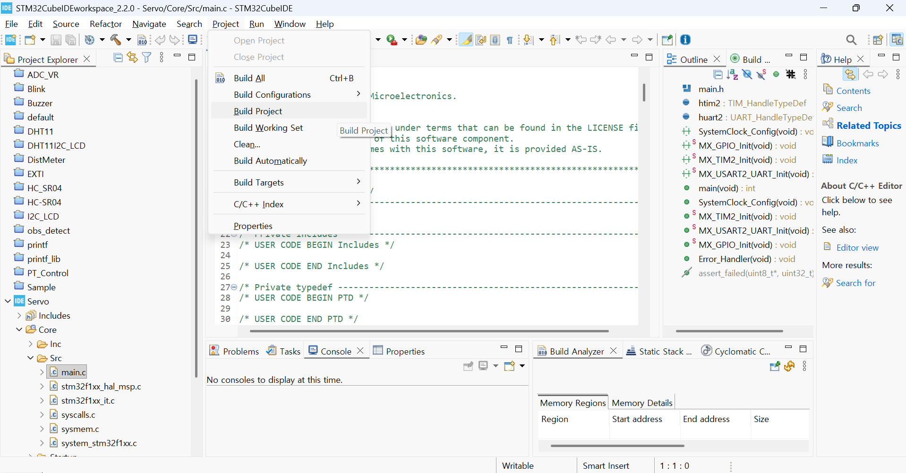


이제 앞서 빌드한 결과를 타겟보드에 올려 동작 시켜보자. **STM32CubeIDE**의 **Run**메뉴의 **Run**항목을 클릭한다.


서보모터의 동작상태를 확인한다.


[**목차**](../../README.md) 