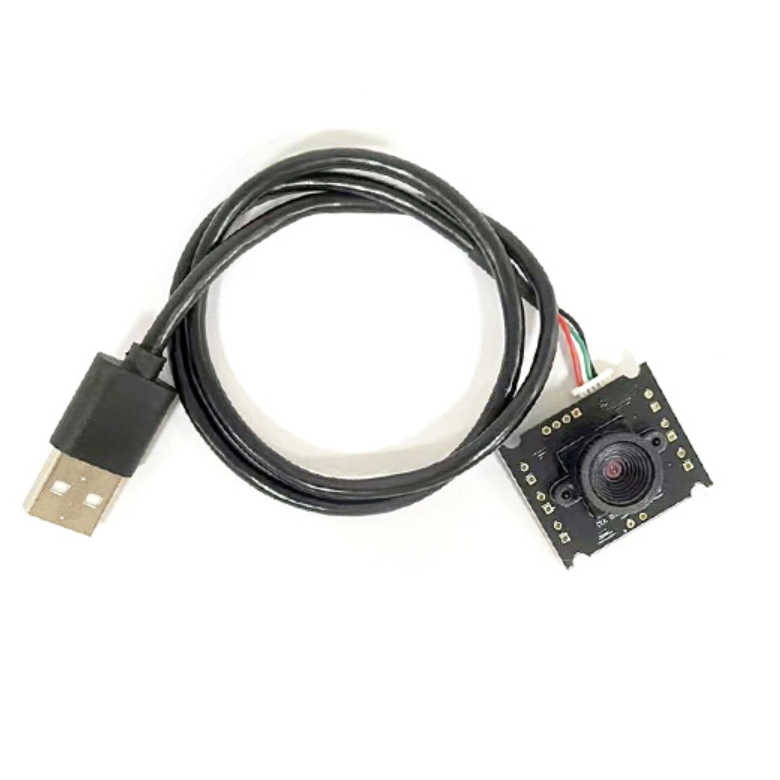
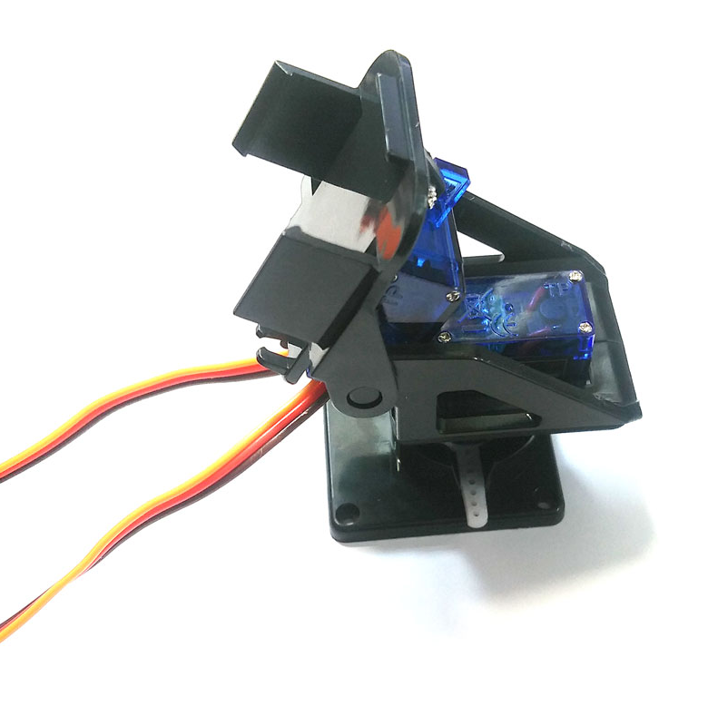
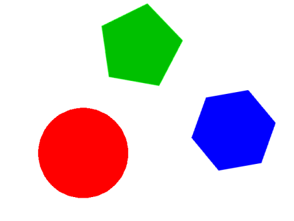
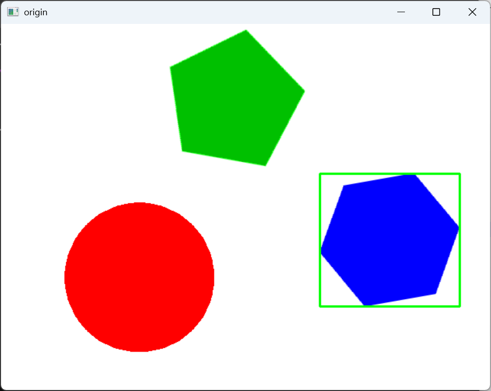
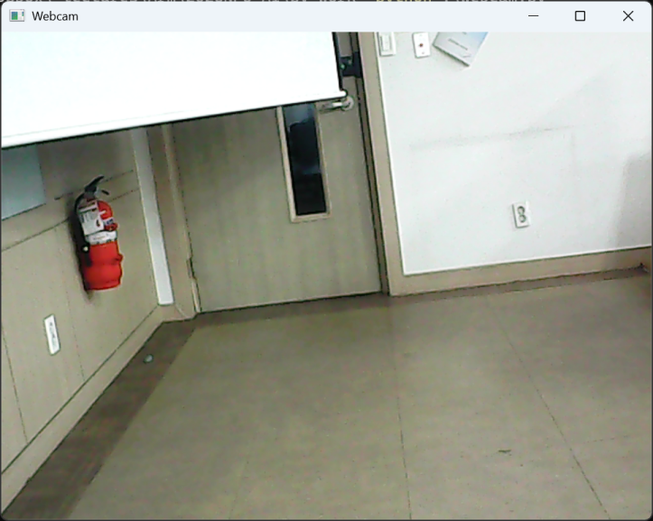
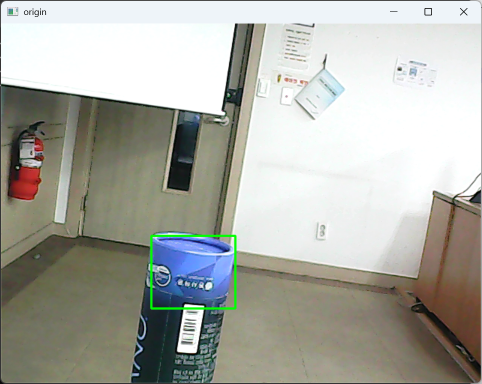
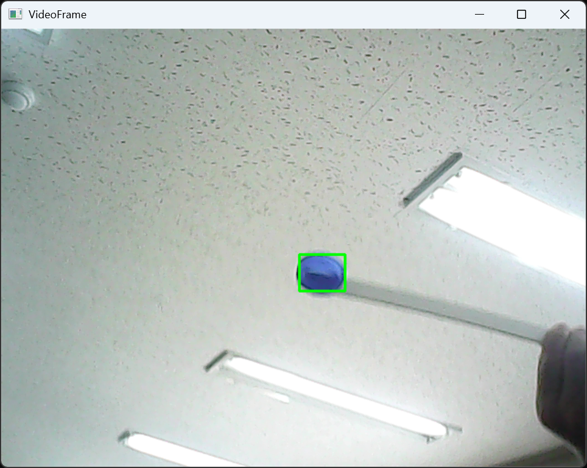

## STM32Cube와 파이썬 OpenCV를 이용한 객체 추적 카메라 구현

준비물 USB 카메라와 마이크로 팬틸트



#### 개발 환경

**OS:** MS Windows11

**개발언어:** Python 3.13.14

**타겟보드:** NUCLEO-F103RB

[**시연 영상**](https://www.youtube.com/watch?v=aH_Pc-fzJRQ)

[**NUCLEO-F103RB 펌웨어 작성 **](../PT_Control/PT_Control.md)

---

필수 라이브러리 설치

- 파이썬용 OpenCV 라이브러리 `opencv-python`설치

```
pip install python-opencv
```


- 파이썬 시리얼 통신 라이브러리 `pyserial`설치

```
pip install pyserial
```


키보드가 눌릴 때 마다 키 입력을 읽어오는 사용자 정의 라이브러리 `getchar.py`작성

```python
import msvcrt


class Getchar:

    def __init__(self):
        pass

    def chk_stdin(self):
        """
        Check whether a key has been pressed.

        Return:
            True  : key input exists
            False : no key input
        """
        return msvcrt.kbhit()

    def getch(self):
        """
        Read one key without pressing Enter.

        Return:
            pressed key as a string
        """
        return msvcrt.getch().decode()
```

파이썬에서 키보드 입력 처리를 위해 제공되는 `input`함수는 키 입력 후 `Enter`키를 입력해야 키 입력이 전달되지만 위 `getchar.py`의 `getch()`함수는 키보드를 누르기만 하면 바로 바로 키 입력이 전달된다. 다음은 `getchar.py`사용 예제`test_getchar.py`이다.

```python
from getchar import Getchar

def main(args=None):
    print("Type any Key!(Type'Q' for quit this Program)\n")
    kb = Getchar()
    key = ''

    while key != 'Q':

        if kb.chk_stdin():
            key = kb.getch()
            print(key, end="", flush=True)


if __name__ == '__main__':
    main()
```


Windows PowerShell 실행, `cd py_work`실행, `python test_getch.py` 실행

```cmd
PS C:\Users\user\py_work> python .\test_getch.py
Type any Key!(Type'Q' for quit this Program)

fghjkjhghjklkjhghjklkjhgmnbvcxlkjhgfoiuytrkjhgfdoiuytr09876545678987654  Q
PS C:\Users\user\py_work>
```

`w`, `s`, `a`, `d` `i` 키를 누르면 시리얼 통신으로 해당 문자를 전송하는 `control_PT.py`를 작성을 위해 NUCLEO-F103RB 보드가 연결된 포트 번호를 확인한다.


 + `R` 을 입력하여 열린 실행 창에 `devmgmt.msc`  입력 후, [ 확인 ] 버튼을 클릭하여 장치관리자를 연 후,  NUCLEO-F103RB가 연결된 COM 포트 번호를 확인한다.


`control_PT.py`작성

```python
from getchar import Getchar
from serial import Serial

sp = Serial('COM3', 115200, timeout=1)

def init():
    sp.write(b'i'); print("init P/T")
    
def up():
    sp.write(b'w'); print("tilt up")
    
def down():
    sp.write(b's'); print("tilt down")
    
def left():
    sp.write(b'a'); print("pan left")
    
def right():
    sp.write(b'd'); print("pan right")
    
def main(args=None):
    try:
        kb = Getchar()
        key = ''
        while key != 'Q':

            if kb.chk_stdin():
                key = kb.getch()
                if key == 'i':
                    init()
                elif key == 'w':
                    up()
                elif key == 's':
                    down()
                elif key == 'a':
                    left()
                elif key == 'd':
                    right()
                else:
                    pass
                
                    print(key)
    except KeyboardInterrupt:
        print("Program terminated!")

if __name__ == '__main__':
    main()
    


```


`python control_PT.py`실행

```cmd
PS D:\Users\user\py_work> python .\controlPT.py
tilt up
tilt up
tilt up
pan right
pan right
pan right
tilt down
tilt down
tilt down
pan left
pan left
pan left
init P/T
Q
PS D:\Users\user\py_work>
```

OpenCV를 이용한 파란색 추출



위 `origin.png` 이미지 파일에서 파란색을 추출하여 `blue.png` 이미지 파일로 저장하는 파이썬 코드`get_blue_from_img.py`를 작성해보자.

```python
import cv2
import numpy as np

    src = cv2.imread("origin.png", cv2.IMREAD_COLOR)
    
    hsv = cv2.cvtColor(src, cv2.COLOR_BGR2HSV)    # Convert from BGR to HSV

    # define range of blue color in HSV
    lower_blue = np.array([100,100,120])          # range of blue
    upper_blue = np.array([150,255,255])

    # Threshold the HSV image to get only blue colors
    mask = cv2.inRange(hsv, lower_blue, upper_blue)     # make blue mask

    # Bitwise-AND mask and original image
    res = cv2.bitwise_and(src, src, mask=mask)      # apply blue mask
    
   while True:
    cv2.imshow("origin",src)       # show original img
    cv2.imshow('blue', res)

    k = cv2.waitKey(10) & 0xFF
        
    if k == 27:
        break
        
cv2.destroyAllWindows()
cv2.imwrite('blue.png', res)

```


`get_blue_from_img.py`를 실행하기 전 `dir *.png`를 실행하여 어떤 `png`파일이 있는 지 확인한다.

```cmd
PS C:\Users\user\py_work> dir *.png


    디렉터리: C:\Users\user\py_work


Mode                 LastWriteTime         Length Name
----                 -------------         ------ ----
-a---l      2025-09-26   오후 2:09           8833 origin.png


PS D:\Dropbox\_lectures\Arm\2026NPU AI\py_work>
```


`python get_blue_from_img.py`실행

```cmd
python get_blue_from_img.py
```


다음과 같은 `imshow` 창이 나타나면 `Esc`키를 눌러 창을 닫는다.

     dir *.png


    디렉터리: C:\Users\user\py_work


Mode                 LastWriteTime         Length Name
----                 -------------         ------ ----
-a---l      2026-09-23   오전 4:33           5807 blue.png
-a---l      2025-09-26   오후 2:09           8833 origin.png


PS C:\Users\user\py_work>
```

`blue.png`가 추가 된 것을 확인할 수 있다.

이제 파란색 영역을 찾아 해당 영역에 외접하는 사각형을 표시하는 `mark_blue_to_img.py`를 작성한다.

```python
import cv2
import numpy as np

src = cv2.imread("origin.png", cv2.IMREAD_COLOR)

hsv = cv2.cvtColor(src, cv2.COLOR_BGR2HSV)    # Convert from BGR to HSV

# define range of blue color in HSV
lower_blue = np.array([100,100,120])          # range of blue
upper_blue = np.array([150,255,255])

# Threshold the HSV image to get only blue colors
mask = cv2.inRange(hsv, lower_blue, upper_blue)

res = cv2.bitwise_and(src, src, mask=mask)

contours, _ = cv2.findContours(
    mask,
    cv2.RETR_EXTERNAL,
    cv2.CHAIN_APPROX_SIMPLE
)

largest_contour = None
largest_area = 0

COLOR = (0, 255, 0)

for cnt in contours:
    area = cv2.contourArea(cnt)

    if area > largest_area:
        largest_area = area
        largest_contour = cnt

if largest_contour is not None:

    if largest_area > 500:

        x, y, width, height = cv2.boundingRect(largest_contour)

        cv2.rectangle(
            src,
            (x, y),
            (x + width, y + height),
            COLOR,
            2
        )
    
while True:
    cv2.imshow("origin",src)       # show original img

    k = cv2.waitKey(10) & 0xFF
        
    if k == 27:
        break
        
cv2.destroyAllWindows()
cv2.imwrite('blue.png', res)

```


`python mark_blue_to_img.py`를 실행한다.




USB카메라의 영상 프레임을 `imshow()`함수로 표시하는 `webcam.py`를 작성해보자.

```python
import cv2

cap = cv2.VideoCapture(1, cv2.CAP_DSHOW)

if not cap.isOpened():
    print("Cannot open camera")
    exit()

while True:

    ret, frame = cap.read()

    if not ret:
        print("Cannot receive frame")
        break

    # image processing
    src = frame

    cv2.imshow("Webcam", src)

    key = cv2.waitKey(10) & 0xFF

    if key == 27:
        break

cap.release()
cv2.destroyAllWindows()
```

`python webcam.py`를 실행한다.




이제 앞서 작성한 `mark_blue_to_img.py`의 파란 영역을 찾아 그 영역에 외접하는 사각형을 그리는 부분을 `webcam.py`에 반영하고, `mark_blue.py`로 저장한다.

``` python
import cv2
import numpy as np

# Open webcam using DirectShow
cap = cv2.VideoCapture(0, cv2.CAP_DSHOW)

if not cap.isOpened():
    print("Cannot open camera")
    exit()

# Define range of blue color in HSV
lower_blue = np.array([100, 100, 120])
upper_blue = np.array([150, 255, 255])

COLOR = (0, 255, 0)

while True:

    # Read one frame from webcam
    ret, src = cap.read()

    if not ret:
        print("Cannot receive frame")
        break

    # Convert from BGR to HSV
    hsv = cv2.cvtColor(src, cv2.COLOR_BGR2HSV)

    # Make blue mask
    mask = cv2.inRange(hsv, lower_blue, upper_blue)

    # Apply blue mask
    res = cv2.bitwise_and(src, src, mask=mask)

    # Find contours directly from binary mask
    contours, _ = cv2.findContours(
        mask,
        cv2.RETR_EXTERNAL,
        cv2.CHAIN_APPROX_SIMPLE
    )

    # Find largest blue object
    largest_contour = None
    largest_area = 0

    for cnt in contours:
        area = cv2.contourArea(cnt)

        if area > largest_area:
            largest_area = area
            largest_contour = cnt

    # Draw bounding box
    if largest_contour is not None:

        if largest_area > 500:

            x, y, width, height = cv2.boundingRect(largest_contour)

            cv2.rectangle(
                src,
                (x, y),
                (x + width, y + height),
                COLOR,
                2
            )

    # Show images
    cv2.imshow("origin", src)
    cv2.imshow("mask", mask)
    cv2.imshow("blue", res)

    # ESC key to quit
    k = cv2.waitKey(10) & 0xFF

    if k == 27:
        break

cap.release()
cv2.destroyAllWindows()
```


`python mark_blue.py`를 실행한다.




위 `mark_blue.py`에 `control_PT.py`의 기능을 추가하여 `track_blue.py`를 작성해보자.

```python

'''
   0         pan left(pan++)           300   320         pan right(pan--)         640
  0+------------------------------------+-----+-----+------------------------------+
   |                                    |     |     |                              |
   |                                    |     |     |                              |
   |                                    |     |     |          tilt up(tilt--)     |
   |                                    |     |     |                              |
   |                                    |     |     |                              |
225+------------------------------------+-----+-----+------------------------------+
   |                                    |     |     |                              |
   |                                    |     |     |                              |
240+------------------------------------+-----+-----+------------------------------+
   |                                    |     |     |                              |
   |                                    |     |     |                              |
255+------------------------------------+-----+-----+------------------------------+
   |                                    |     |     |                              |
   |                                    |     |     |                              |
   |                                    |     |     |                              |
   |                                    |     |     |          tilt down(tilt++)   |
   |                                    |     |     |                              |
   |                                    |     |     |                              |
   |                                    |     |     |                              |
   |                                    |     |     |                              |
480+------------------------------------+-----+-----+------------------------------+
'''
import cv2
import numpy as np
import serial
import time
margin_x = 60
margin_y = 45

sp  = serial.Serial('COM3', 115200, timeout=0.125)


# Open webcam using DirectShow
cap = cv2.VideoCapture(1, cv2.CAP_DSHOW)  # 2nd camera

if not cap.isOpened():
    print("Cannot open camera")
    exit()

cap.set(cv2.CAP_PROP_FRAME_WIDTH, 640)
cap.set(cv2.CAP_PROP_FRAME_HEIGHT, 480)
#cap.set(cv2.CAP_PROP_FRAME_FPS, 10)

def up():
    sp.write(b'w')
def down():
    sp.write(b's')   
def left():
    sp.write(b'a')
def right():
    sp.write(b'd')

if not cap.isOpened():
    print("Could not open camera")
    exit()

while cap.isOpened():
    time.sleep(0.01)
    status, frame = cap.read() #  read camera frame
    
    hsv = cv2.cvtColor(frame, cv2.COLOR_BGR2HSV)    # Convert from BGR to HSV

    # define range of blue color in HSV
    lower_blue = np.array([100,100,120])          # range of blue
    upper_blue = np.array([150,255,255])

    lower_green = np.array([50, 150, 50])        # range of green
    upper_green = np.array([80, 255, 255])

    lower_red = np.array([150, 50, 50])        # range of red
    upper_red = np.array([180, 255, 255])

    # Threshold the HSV image to get only blue colors
    mask = cv2.inRange(hsv, lower_blue, upper_blue)     # color range of blue
    mask1 = cv2.inRange(hsv, lower_green, upper_green)  # color range of green
    mask2 = cv2.inRange(hsv, lower_red, upper_red)      # color range of red

    # Bitwise-AND mask and original image
    res1 = cv2.bitwise_and(frame, frame, mask=mask)      # apply blue mask
    res = cv2.bitwise_and(frame, frame, mask=mask1)    # apply green mask
    res2 = cv2.bitwise_and(frame, frame, mask=mask2)    # apply red mask
    
    gray = cv2.cvtColor(res1, cv2.COLOR_BGR2GRAY)    
    _, bin = cv2.threshold(gray, 30, 255, cv2.THRESH_BINARY)
        
    contours, _ = cv2.findContours(bin, cv2.RETR_EXTERNAL, cv2.CHAIN_APPROX_SIMPLE)
    
    largest_contour = None
    largest_area = 0    
    
    COLOR = (0, 255, 0)
    for cnt in contours:                # find largest blue object
        area = cv2.contourArea(cnt)
        if area > largest_area:
            largest_area = area
            largest_contour = cnt
            
     # draw bounding box with green line
    if largest_contour is not None:
        #area = cv2.contourArea(cnt)
        if largest_area > 768:  # draw only larger than 500
            x, y, width, height = cv2.boundingRect(largest_contour)
            center_x = x + width//2
            center_y = y + height//2
            print("center: ( %s, %s )"%(center_x, center_y))
            '''---------------------------------------------------'''
            if center_x <= 320-margin_x:### need pan left ###########
                left()
            elif center_x > 320+margin_x: ### need pan right ########
                right()
            else:
                pass
            '''---------------------------------------------------'''
            if center_y <= 240-margin_y:### need tilt up ##########
                up()
            elif center_y > 240+margin_x: ### need tilt down ##########
                down()
            else: ########################### no need move tilt
                pass
            cv2.rectangle(frame, (x, y), (x + width, y + height), COLOR, 2)
            time.sleep(0.05)   
    cv2.imshow("VideoFrame",frame)       # show original frame
    #cv2.imshow('Blue', res)           # show applied blue mask
    #cv2.imshow('Green', res1)          # show appliedgreen mask
    #cv2.imshow('red', res2)          # show applied red mask

    k = cv2.waitKey(5) & 0xFF
        
    if k == 27:
        break
   
        
cap.release()
cv2.destroyAllWindows()

```

`python track_blue.py`를 실행한다.




카메라 화면의 파란색 오브젝트를 이리저리 움직여도 팬틸트가 움직여 항상 화면 중앙에 파란색 오브젝트가 위치하는 것을 확인한다.


[OpenCV 파이썬 얼굴인식](https://deep-eye.tistory.com/18)

위 링크의 얼굴인식 예제에 `track_blue.py`의 객체 추적을 적용하여 `track_face.py`를 작성해 보자. 코드가 동작하려면 `haarcascade_frontalface_alt.xml`파일이 소스코드와 같은 위치에 있어야 한다.

```python
'''
    0         pan left(pan++)           300   320         pan right(pan--)            640
  0 +------------------------------------+-----+-----+----------------------------------+
    |                                    |     |     |                                  | 
    |                                    |     |     |                                  | 
    |                                    |     |     |          tilt up(tilt--)         | 
    |                                    |     |     |                                  | 
    |                                    |     |     |                                  | 
225 +------------------------------------+-----+-----+----------------------------------+ 
    |                                    |     |     |                                  | 
    |                                    |     |     |                                  |
240 +------------------------------------+-----+-----+----------------------------------+  |                                        |     |     |                                  |   |                                      |     |     |                                  | 
255 +------------------------------------+-----+-----+----------------------------------+ 
    |                                    |     |     |                                  | 
    |                                    |     |     |                                  | 
    |                                    |     |     |                                  | 
    |                                    |     |     |          tilt down(tilt++)       | 
    |                                    |     |     |                                  | 
    |                                    |     |     |                                  | 
    |                                    |     |     |                                  | 
    |                                    |     |     |                                  |  480 +------------------------------------+-----+-----+----------------------------------+ 
'''
import cv2
import numpy as np
import serial
import time

margin_x = 60
margin_y = 45

sp  = serial.Serial('COM3', 115200, timeout=0.125)
cascade_filename = 'haarcascade_frontalface_alt.xml'
# 모델 불러오기
cascade = cv2.CascadeClassifier(cascade_filename)

def up():
    sp.write(b'w'); print("tilt up")
def down():
    sp.write(b's'); print("tilt down")
def left():
    sp.write(b'a'); print("pan_left")
def right():
    sp.write(b'd'); print("pan_right")


cap = cv2.VideoCapture(1, cv2.CAP_DSHOW)  # 1 means 2nd camera

if not cap.isOpened():
    print("Cannot open camera")
    exit()

cap.set(cv2.CAP_PROP_FRAME_WIDTH, 640)
cap.set(cv2.CAP_PROP_FRAME_HEIGHT, 480)
#cap.set(cv2.CAP_PROP_FRAME_FPS, 10)

def up():
    sp.write(b'w')
def down():
    sp.write(b's')   
def left():
    sp.write(b'a')
def right():
    sp.write(b'd')

while cap.isOpened():
    time.sleep(0.01)
    status, img = cap.read() #  read camera frame
    
    
    # 영상 압축
    img = cv2.resize(img,dsize=None,fx=1.0,fy=1.0)
    # 그레이 스케일 변환
    gray = cv2.cvtColor(img, cv2.COLOR_BGR2GRAY) 
    # cascade 얼굴 탐지 알고리즘 
    results = cascade.detectMultiScale(gray,            # 입력 이미지
                                           scaleFactor= 1.1,# 이미지 피라미드 스케일 factor
                                           minNeighbors=5,  # 인접 객체 최소 거리 픽셀
                                           minSize=(20,20)  # 탐지 객체 최소 크기
                                           )
    for box in results:
        x, y, w, h = box
        cv2.rectangle(img, (x,y), (x+w, y+h), (255,255,255), thickness=2)
        center_x = x + w//2
        center_y = y + h//2
        print("center: ( %s, %s )"%(center_x, center_y))
        if center_x <= 320-margin_x:### need pan left ###########
                left()
        elif center_x > 320+margin_x: ### need pan right ########
            right()
        else:
            pass
        '''---------------------------------------------------'''
        if center_y <= 240-margin_y:### need tilt up ##########
            up()
        elif center_y > 240+margin_y: ### need tilt down ##########
            down()
        else: ########################### no need move tilt
            pass
    
    cv2.imshow('facenet',img)
    k = cv2.waitKey(10) & 0xFF

    if k == 27:
        break
```


[**목차**](../../README.md) 
