## STM32Cube를 이용한 STM32 프로그래밍

### USART2를 이용한 printf()를 지원하는 사용자 라이브러리 작성

앞서 [USART2를 이용한 printf()구현](../printf/printf.md)에서 USART2를 이용하여 `printf()`를 구현한 방법을 `printf()`가 필요할 때 헤더파일을 include하여 호출할 수 있도록 UART2를 이용한 `printf()`를 지원하는사용자 정의 라이브러리 `uart2_printf.h`와 `uart2_printf.c`를 작성하여, 테스트해보자.

##### 개발 환경

**OS:** MS Windows11

**타겟보드:** NUCLEO-F103RB

**Development SW Tools:** [STM32CubeMX 6.18.1](https://www.st.com/en/development-tools/stm32cubemx.html) / [STM32CubeIDE 2.20](https://www.st.com/en/development-tools/stm32cubeide.html)

---

**CubeMX에서 설정할 Peripheral**

​	**RCC**의  클럭 소스만 설정 하고 나머지 **Peripheral**은 기본값으로 설정(따로 설정하지 않는다.) 

새로운 STM32 프로젝트 생성을 위해 STM32CubeMX 실행 후, 타겟 설정을 위해 **ACCESS TO BOARD SELECTOR**를 클릭한다.


New Project from Board 화면의 **PRODUCT INFO**의 **Type**에서 **Nucleo-64**를 체크한다. 


New Project fron Board 화면의 **PRODUCT INFO**를 스크롤다운해서 **MCU/MPU Series**에서 **STM32F1**을 체크하면 화면 우측의 **Board List**가 확 줄어든 것을 볼 수 있다. 그 중에서 타겟보드로 사용중인 **NUCLEO-F103RB**를 선택 후 화면 오른쪽 상단의 **Start Project**를 클릭한다.


모든 주변장치들을 기본 모드로 초기화 하겠냐는 팝업창이 나타나면 [  Yes  ]를 클릭한다.


최우선으로 설정해야 하는 것은 **RCC** 설정이다. **Pinout & Configuration**탭에서 **System Core**를 선택 후,  **RCC**를 클릭하고 바로 우측의 RCC Mode and Configuration의 Mode에서 High Speed Clock(HSE)와 Low Speed Clock(LSE)를 모두 Disable로 설정한다. 이는 모든 외부 클럭을 Disable시킨 것으로 내부클럭(HSI)를 클럭 소스로 사용하겠다는 의미이다.


CLOCK설정 확인을 위해 **Clock Configuration**탭을 클릭하여 최초 **HSI**(High Speed Internal Clock) 8MHz를 소스 클럭으로 시작하여 64MHz의 시스템 클럭으로 공급되는 것을 확인한다.

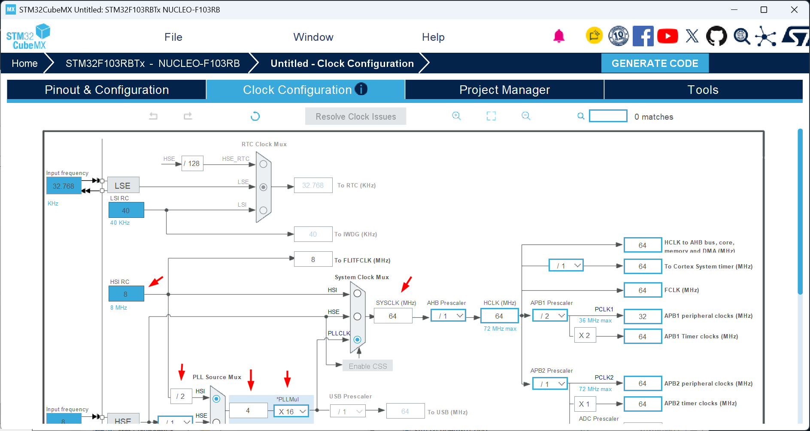


다음은 [ Initialize all peripheral with their default Mode ? ]팝업 창에서 [ Yes ]를 클릭한 경우의 **GPIO** 설정상태이다.

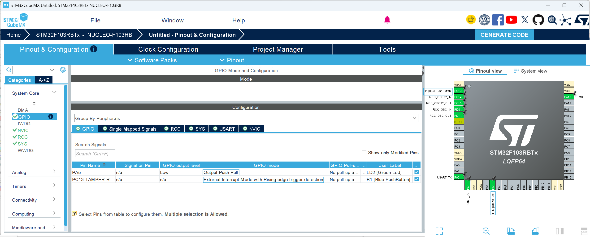

다음 역시 [ Initialize all peripheral with their default Mode ? ]팝업 창에서 [ Yes ]를 클릭한 경우의 **USART2** 설정상태이다.

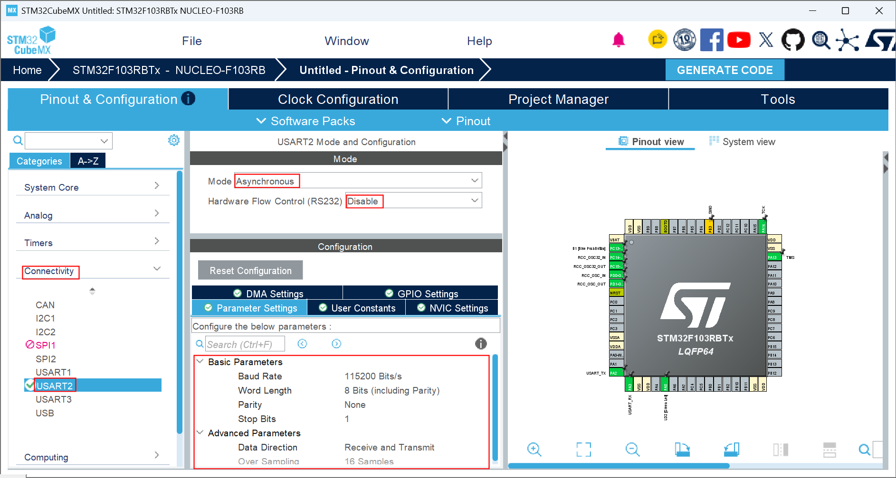


여기까지 설정을 반영한 코드를 생성하기위해 **Generate Code**를 클릭 하기 전 **STM32CubeMX**에서 생성한 프로젝트들을 저장해 둘 폴더를 만들어 두어야 한다. 그 위치는 편의상 **STM32CubeIDEworkspace_2.2.0** 폴더와 같은 폴더에, 폴더 이름은 **STM32CubeProjects**(폴더 이름은 다른 임의의이름(영문, 숫자 조합 한글×)을 사용해도 되나 그 위치와 이름을 정확히 기억하자 )로 만들어 둔다. 아래 그림에서도 **STM32CubeIDEworkspace_2.2.0**폴더가 있는 위치에 **STM32CubeProjects** 폴더가 만들어져 있는 것을 확인할 수 있다.


이제 **Project Manager** 탭을 클릭한다. 


아래와 같이 Project Manager 화면이 열린다.

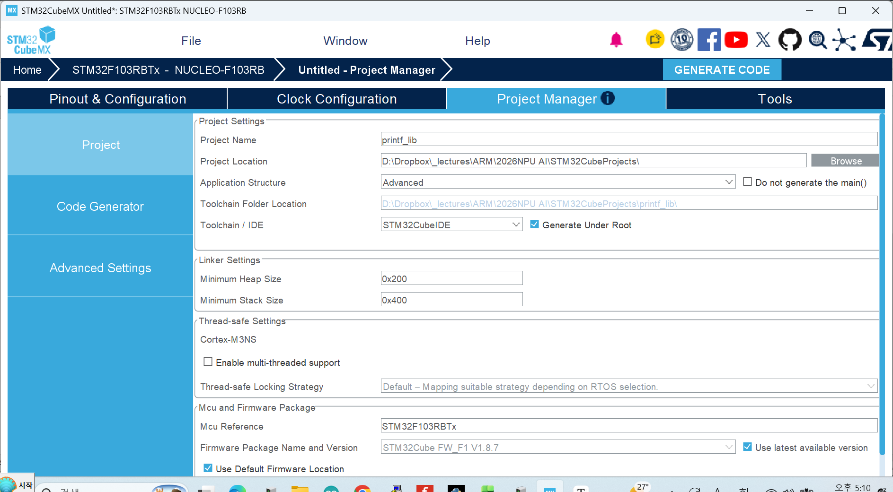

**1. Project Location** : [Browse]버튼을 클릭하여 앞서 **STM32CubeMX**에서 생성한 프로젝트들을 저장하기위해 만들어 둔 **STM32CubeProjects** 폴더를 지정한다. 이 작업이 선행되어야 다음 단계에서 입력한 **Project Name**과 같은 이름의 폴더가 이 위치에 생성될 수 있다.

**2. Project Name** :프로젝트 이름을 영문, 숫자 조합으로 작성(한글×)한다. 이 프로젝트 명은 **printf_lib** 로 하자.

**3. Toolchain / IDE** : STM32CubeIDE를 선택한다.( **매우 중요함.** 잘못 지정되어 있을 경우 **STM32CubeIDE**에서 프로젝트가 열리지 않는다. )

**4. GENERATE CODE**를 클릭한다.


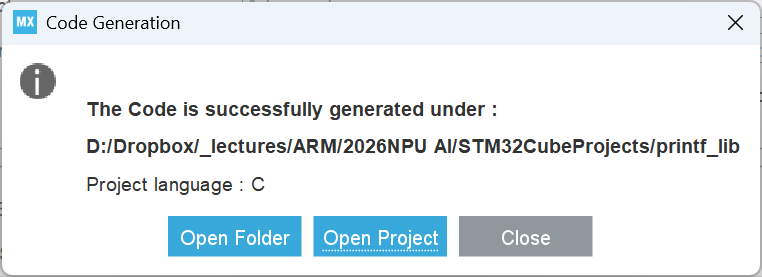

위 The Code is successfully generated... 팝업 메세지 창에서 **[ Open Project]** 를 클릭하면 Project Manager에서 Toolchain / IDE로 지정한 **STM32CubeIDE**가 자동 실행되며 다음 팝업과 함께 Project Explore에 해당 프로젝트가 로딩된다.

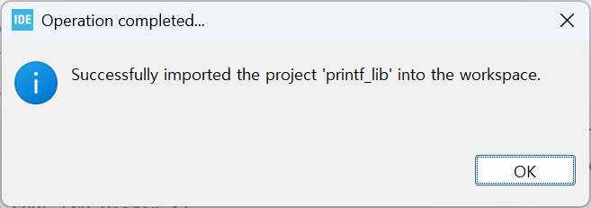

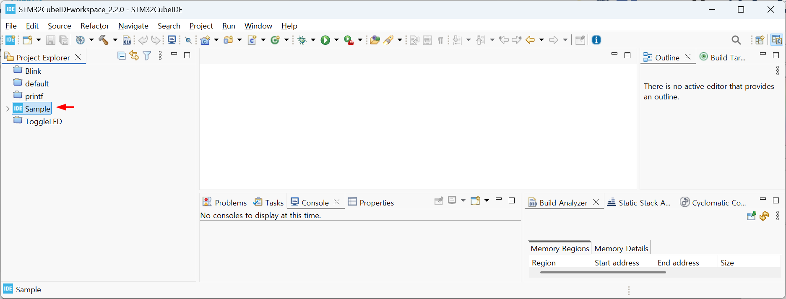


**Project Explorer**에서 **printf_lib** > **Core** > **Src** > **main.c** 순서로 각 항목을 확장시켜 **main.c**를 연다.

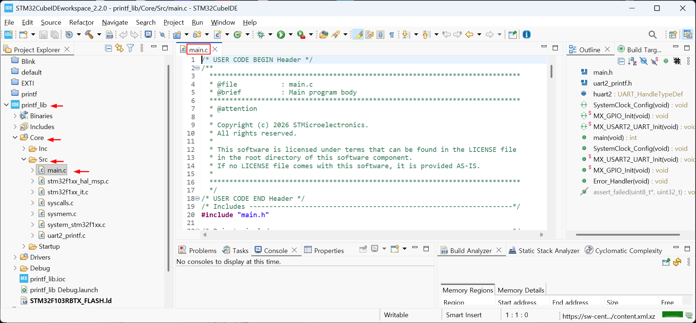


**STM32CubeIDE** 의 **Project**메뉴의 **Build Project**항목을 클릭하여 테스트 빌드를 수행한다.


**STM32CubeIDE**의 **Project Explorer**에서 **printf_lib**프로젝트의 **Core**의 **Inc** 항목에 대고 마우스 오른쪽 버튼을 클릭하여 열린 컨텍스트 메뉴에서 **NEW** - **Header File**을 선택한다.


다음 팝업 창의 **Header file:** 란에 `uart2_printf.h`를 입력하고 [  Finish ]버튼을 클릭한다.


다음 팝업 창의 **Source file:** 란에 `uart2_printf.c`를 입력하고 [  Finish ]버튼을 클릭한다.

 calls __io_putchar() */
#define PUTCHAR_PROTOTYPE int __io_putchar(int ch)
#else
#define PUTCHAR_PROTOTYPE int fputc(int ch, FILE *f)
#endif /* __GNUC__ */

/**
  * @brief  Retargets the C library printf function to the USART.
  * @param  None
  * @retval None
  */
PUTCHAR_PROTOTYPE
{
  /* Place your implementation of fputc here */
  /* e.g. write a character to the USART1 and Loop until the end of transmission */
  if (ch == '\n')
    HAL_UART_Transmit (&huart2, (uint8_t*) "\r", 1, 0xFFFF);
  HAL_UART_Transmit (&huart2, (uint8_t*) &ch, 1, 0xFFFF);

  return ch;
}

```


**<u>P</u>roject**메뉴의 **Build Project**항목을 클릭하여 프로젝트에 추가된 파일들(`uart2_printf.h`, `uart2_printf.c`)의 무결성을 검사한다.


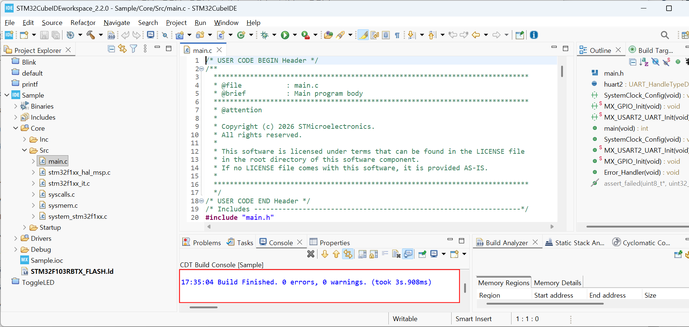


다음은 **STM32CubeMX**에서 **printf_lib**프로젝트에 대해 자동 생성한 **main.c**의 내용이다.

```c
/* USER CODE BEGIN Header */
/**
  ******************************************************************************
  * @file           : main.c
  * @brief          : Main program body
  ******************************************************************************
  * @attention
  *
  * Copyright (c) 2026 STMicroelectronics.
  * All rights reserved.
  *
  * This software is licensed under terms that can be found in the LICENSE file
  * in the root directory of this software component.
  * If no LICENSE file comes with this software, it is provided AS-IS.
  *
  ******************************************************************************
  */
/* USER CODE END Header */
/* Includes ------------------------------------------------------------------*/
#include "main.h"

/* Private includes ----------------------------------------------------------*/
/* USER CODE BEGIN Includes */

/* USER CODE END Includes */

/* Private typedef -----------------------------------------------------------*/
/* USER CODE BEGIN PTD */

/* USER CODE END PTD */

/* Private define ------------------------------------------------------------*/
/* USER CODE BEGIN PD */

/* USER CODE END PD */

/* Private macro -------------------------------------------------------------*/
/* USER CODE BEGIN PM */

/* USER CODE END PM */

/* Private variables ---------------------------------------------------------*/
UART_HandleTypeDef huart2;

/* USER CODE BEGIN PV */

/* USER CODE END PV */

/* Private function prototypes -----------------------------------------------*/
void SystemClock_Config(void);
static void MX_GPIO_Init(void);
static void MX_USART2_UART_Init(void);
/* USER CODE BEGIN PFP */

/* USER CODE END PFP */

/* Private user code ---------------------------------------------------------*/
/* USER CODE BEGIN 0 */

/* USER CODE END 0 */

/**
  * @brief  The application entry point.
  * @retval int
  */
int main(void)
{

  /* USER CODE BEGIN 1 */

  /* USER CODE END 1 */

  /* MCU Configuration--------------------------------------------------------*/

  /* Reset of all peripherals, Initializes the Flash interface and the Systick. */
  HAL_Init();

  /* USER CODE BEGIN Init */

  /* USER CODE END Init */

  /* Configure the system clock */
  SystemClock_Config();

  /* USER CODE BEGIN SysInit */

  /* USER CODE END SysInit */

  /* Initialize all configured peripherals */
  MX_GPIO_Init();
  MX_USART2_UART_Init();
  /* USER CODE BEGIN 2 */

  /* USER CODE END 2 */

  /* Infinite loop */
  /* USER CODE BEGIN WHILE */
  while (1)
  {
    /* USER CODE END WHILE */

    /* USER CODE BEGIN 3 */
  }
  /* USER CODE END 3 */
}

/**
  * @brief System Clock Configuration
  * @retval None
  */
void SystemClock_Config(void)
{
  RCC_OscInitTypeDef RCC_OscInitStruct = {0};
  RCC_ClkInitTypeDef RCC_ClkInitStruct = {0};

  /** Initializes the RCC Oscillators according to the specified parameters
  * in the RCC_OscInitTypeDef structure.
  */
  RCC_OscInitStruct.OscillatorType = RCC_OSCILLATORTYPE_HSI;
  RCC_OscInitStruct.HSIState = RCC_HSI_ON;
  RCC_OscInitStruct.HSICalibrationValue = RCC_HSICALIBRATION_DEFAULT;
  RCC_OscInitStruct.PLL.PLLState = RCC_PLL_ON;
  RCC_OscInitStruct.PLL.PLLSource = RCC_PLLSOURCE_HSI_DIV2;
  RCC_OscInitStruct.PLL.PLLMUL = RCC_PLL_MUL16;
  if (HAL_RCC_OscConfig(&RCC_OscInitStruct) != HAL_OK)
  {
    Error_Handler();
  }

  /** Initializes the CPU, AHB and APB buses clocks
  */
  RCC_ClkInitStruct.ClockType = RCC_CLOCKTYPE_HCLK|RCC_CLOCKTYPE_SYSCLK
                              |RCC_CLOCKTYPE_PCLK1|RCC_CLOCKTYPE_PCLK2;
  RCC_ClkInitStruct.SYSCLKSource = RCC_SYSCLKSOURCE_PLLCLK;
  RCC_ClkInitStruct.AHBCLKDivider = RCC_SYSCLK_DIV1;
  RCC_ClkInitStruct.APB1CLKDivider = RCC_HCLK_DIV2;
  RCC_ClkInitStruct.APB2CLKDivider = RCC_HCLK_DIV1;

  if (HAL_RCC_ClockConfig(&RCC_ClkInitStruct, FLASH_LATENCY_2) != HAL_OK)
  {
    Error_Handler();
  }
}

/**
  * @brief USART2 Initialization Function
  * @param None
  * @retval None
  */
static void MX_USART2_UART_Init(void)
{

  /* USER CODE BEGIN USART2_Init 0 */

  /* USER CODE END USART2_Init 0 */

  /* USER CODE BEGIN USART2_Init 1 */

  /* USER CODE END USART2_Init 1 */
  huart2.Instance = USART2;
  huart2.Init.BaudRate = 115200;
  huart2.Init.WordLength = UART_WORDLENGTH_8B;
  huart2.Init.StopBits = UART_STOPBITS_1;
  huart2.Init.Parity = UART_PARITY_NONE;
  huart2.Init.Mode = UART_MODE_TX_RX;
  huart2.Init.HwFlowCtl = UART_HWCONTROL_NONE;
  huart2.Init.OverSampling = UART_OVERSAMPLING_16;
  if (HAL_UART_Init(&huart2) != HAL_OK)
  {
    Error_Handler();
  }
  /* USER CODE BEGIN USART2_Init 2 */

  /* USER CODE END USART2_Init 2 */

}

/**
  * @brief GPIO Initialization Function
  * @param None
  * @retval None
  */
static void MX_GPIO_Init(void)
{
  GPIO_InitTypeDef GPIO_InitStruct = {0};
  /* USER CODE BEGIN MX_GPIO_Init_1 */

  /* USER CODE END MX_GPIO_Init_1 */

  /* GPIO Ports Clock Enable */
  __HAL_RCC_GPIOC_CLK_ENABLE();
  __HAL_RCC_GPIOD_CLK_ENABLE();
  __HAL_RCC_GPIOA_CLK_ENABLE();
  __HAL_RCC_GPIOB_CLK_ENABLE();

  /*Configure GPIO pin Output Level */
  HAL_GPIO_WritePin(GPIOA, GPIO_PIN_5, GPIO_PIN_RESET);

  /*Configure GPIO pin : PC13 */
  GPIO_InitStruct.Pin = GPIO_PIN_13;
  GPIO_InitStruct.Mode = GPIO_MODE_INPUT;
  GPIO_InitStruct.Pull = GPIO_PULLUP;
  HAL_GPIO_Init(GPIOC, &GPIO_InitStruct);

  /*Configure GPIO pin : PA5 */
  GPIO_InitStruct.Pin = GPIO_PIN_5;
  GPIO_InitStruct.Mode = GPIO_MODE_OUTPUT_PP;
  GPIO_InitStruct.Pull = GPIO_NOPULL;
  GPIO_InitStruct.Speed = GPIO_SPEED_FREQ_LOW;
  HAL_GPIO_Init(GPIOA, &GPIO_InitStruct);

  /* USER CODE BEGIN MX_GPIO_Init_2 */

  /* USER CODE END MX_GPIO_Init_2 */
}

/* USER CODE BEGIN 4 */

/* USER CODE END 4 */

/**
  * @brief  This function is executed in case of error occurrence.
  * @retval None
  */
void Error_Handler(void)
{
  /* USER CODE BEGIN Error_Handler_Debug */
  /* User can add his own implementation to report the HAL error return state */
  __disable_irq();
  while (1)
  {
  }
  /* USER CODE END Error_Handler_Debug */
}
#ifdef USE_FULL_ASSERT
/**
  * @brief  Reports the name of the source file and the source line number
  *         where the assert_param error has occurred.
  * @param  file: pointer to the source file name
  * @param  line: assert_param error line source number
  * @retval None
  */
void assert_failed(uint8_t *file, uint32_t line)
{
  /* USER CODE BEGIN 6 */
  /* User can add his own implementation to report the file name and line number,
     ex: printf("Wrong parameters value: file %s on line %d\r\n", file, line) */
  /* USER CODE END 6 */
}
#endif /* USE_FULL_ASSERT */

```


`main.c`의 23~25행의 다음 코드를 찾는다.

```c
/* USER CODE BEGIN Includes */

/* USER CODE END Includes */

```


위코드를 다음과 같이 수정 편집 후 저장한다.

```c
/* USER CODE BEGIN Includes */
#include "uart2_printf.h"
/* USER CODE END Includes */
```


`main.c`의 92~94행의 다음 코드를 찾는다.

```c
/* USER CODE BEGIN 2 */

  /* USER CODE END 2 */

```


위코드를 다음과 같이 수정 편집 후 저장한다.

```c
/* USER CODE BEGIN 2 */
  printf("here is outside of Infinite loop!\n");
  /* USER CODE END 2 */
```


`main.c`의 97~101행의 다음 코드를 찾는다.

```c
/* USER CODE BEGIN WHILE */
  while (1)
  {
    /* USER CODE END WHILE */

```


위코드를 다음과 같이 수정 편집 후 저장한다.

```c
/* USER CODE BEGIN WHILE */
  while (1)
  {
	  printf("here is inside of Infinite loop.\n");
      HAL_Delay(500);
    /* USER CODE END WHILE */
```


**STM32CubeIDE**의 **Project** 메뉴의 **Build Project** 항목을 클릭하여 프로젝트를 빌드하고, 빌드한 결과를 타겟보드에 올려 동작 시켜보자. **STM32CubeIDE**의 **<u>R</u>UN**메뉴의 **Run**항목을 클릭한다.

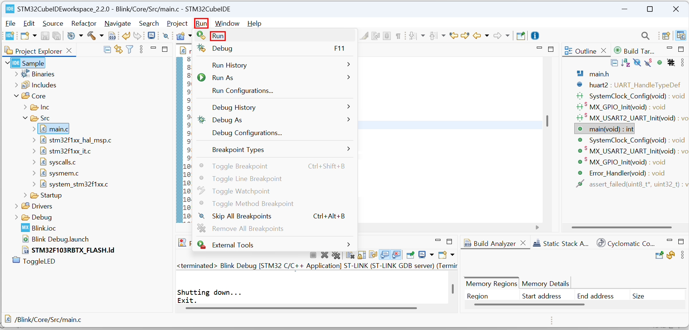


 + `R` 을 입력하여실행 창을 연다.

 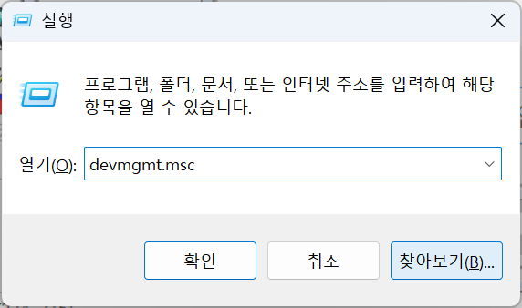

실행 창에 `devmgmt.msc`입력 후  [  확인  ]버튼을 클릭하여, 장치관리자를 연 후,  NUCLEO-F103RB가 연결된 COM 포트 번호를 확인한다.

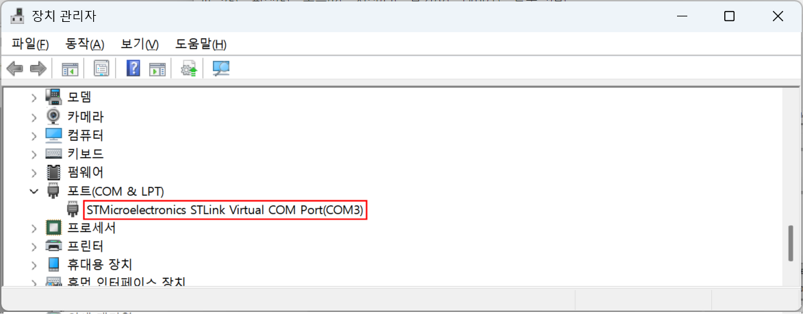

이제 적당한 시리얼 통신 에뮬레이터 프로그램( **[Putty](https://www.chiark.greenend.org.uk/~sgtatham/putty/latest.html)**, **[Tera Term](https://teratermproject.github.io/index-en.html)** 등 )에서 포트 COM3을 Baudrate 115200 으로 열어  확인한다.

`printf()`함수로 출력한 문자열이 수신되는 것을 확인한다.

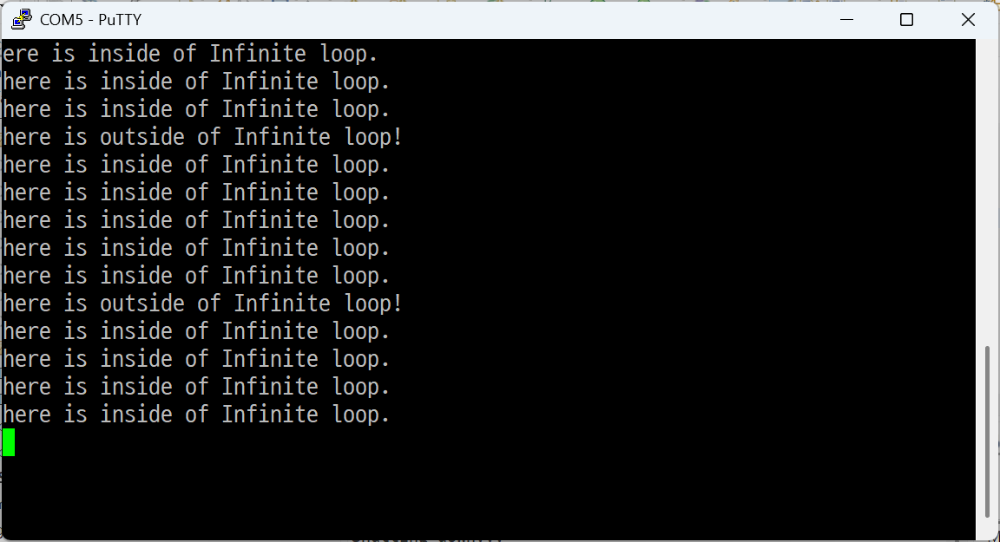


[**목차**](../../README.md) 
